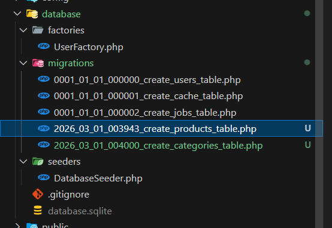
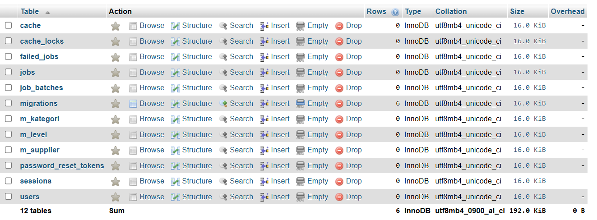
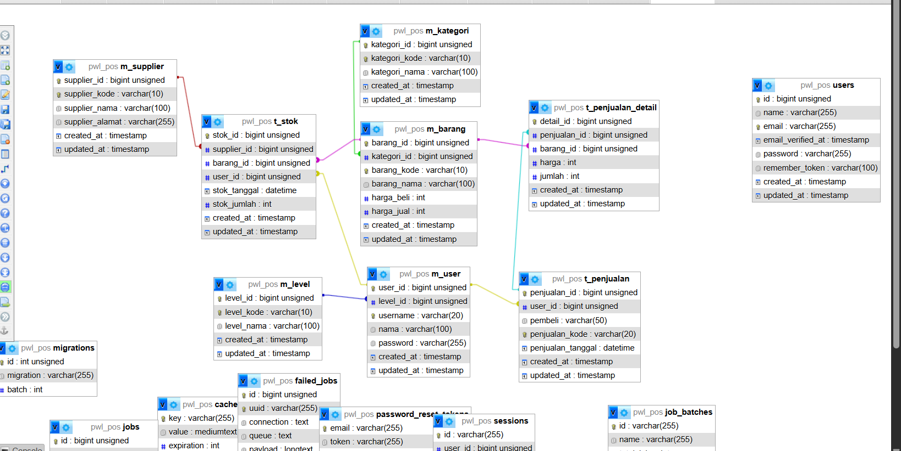
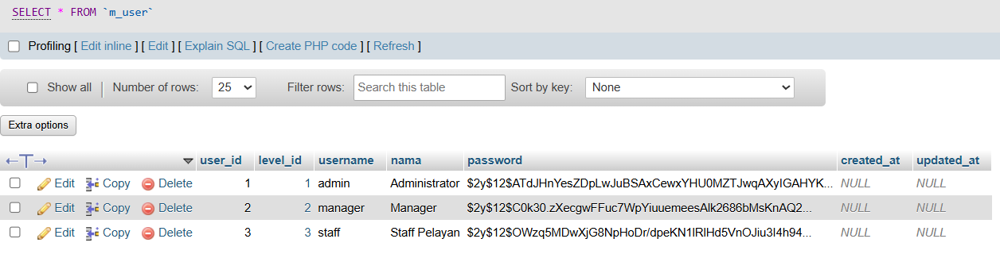
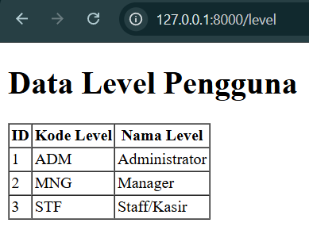
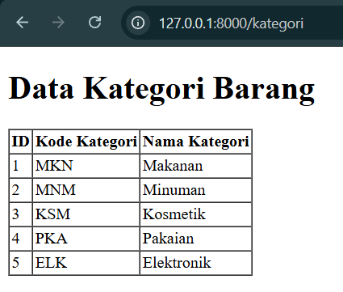
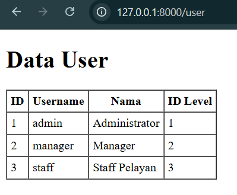

# Week 3 - Migration dan Seeder

## Topik Pembelajaran

- Database Migration
- Database Seeding
- DB Facade, Query Builder, dan Eloquent ORM

---

## Praktikum 1 - Pengaturan Database

Konfigurasi database MySQL di file `.env`:

```env
DB_CONNECTION=mysql
DB_HOST=127.0.0.1
DB_PORT=3306
DB_DATABASE=PWL_POS
DB_USERNAME=root
DB_PASSWORD=
```

Generate application key:

```bash
php artisan key:generate
```



---

## Praktikum 2.1 - Pembuatan File Migrasi Tanpa Relasi

Membuat migration untuk tabel `m_level`:

```bash
php artisan make:migration create_m_level_table --create=m_level
```

Edit migration dengan kolom: `level_id`, `level_kode`, `level_nama`, `timestamps`

```bash
php artisan migrate
```



---

## Praktikum 2.2 - Pembuatan File Migrasi Dengan Relasi

Membuat migration untuk tabel `m_user` dengan foreign key:

```bash
php artisan make:migration create_m_user_table --create=m_user
```

Edit migration dengan kolom: `user_id`, `level_id (FK)`, `username`, `nama`, `password`, `timestamps`

```bash
php artisan migrate
```



---

## Praktikum 3 - Membuat File Seeder

Membuat dan menjalankan seeder:

```bash
php artisan make:seeder LevelSeeder
php artisan make:seeder UserSeeder
php artisan db:seed
```

UserSeeder menggunakan `Hash::make()` untuk enkripsi password.



---

## Praktikum 4 - Implementasi DB Facade

Operasi CRUD menggunakan Raw SQL dengan parameter binding (?):

```php
// Insert
DB::insert('INSERT INTO m_user(...) VALUES (?, ?, ?)', [...]);

// Update
DB::update('UPDATE m_user SET username = ? WHERE username = ?', [...]);

// Select
DB::select('SELECT * FROM m_user');

// Delete
DB::delete('DELETE FROM m_user WHERE username = ?', [...]);
```



---

## Praktikum 5 - Implementasi Query Builder

Operasi CRUD menggunakan Query Builder:

```php
// Insert
DB::table('m_user')->insert([...]);

// Update
DB::table('m_user')->where('username', '...')->update([...]);

// Select
DB::table('m_user')->get();

// Delete
DB::table('m_user')->where('username', '...')->delete();
```



---

## Praktikum 6 - Implementasi Eloquent ORM

Membuat Model dan operasi CRUD:

```bash
php artisan make:model UserModel
```

Konfigurasi model:

```php
protected $table = 'm_user';
protected $primaryKey = 'user_id';
protected $fillable = ['username', 'nama', 'password', 'level_id'];
```

Operasi CRUD:

```php
// Insert
UserModel::create([...]);

// Update
$user->update([...]);

// Select
UserModel::all();

// Delete
$user->delete();
```



---

## G. Penutup - Pertanyaan dan Jawaban

### 1. Fungsi APP_KEY pada file .env?

APP_KEY itu buat keamanan aplikasi, dipake Laravel buat enkripsi session, cookie, dan password. Kayak kunci rahasia aplikasi kita.

### 2. Cara generate APP_KEY?

```bash
php artisan key:generate
```

### 3. File migrasi default Laravel?

Ada 3 file: `create_users_table`, `create_cache_table`, `create_jobs_table` untuk users, cache, dan queue.

### 4. Fungsi $table->timestamps()?

Otomatis bikin 2 kolom: `created_at` dan `updated_at` buat tracking waktu.

### 5. Tipe data dari $table->id()?

**UNSIGNED BIGINT** dengan AUTO_INCREMENT dan PRIMARY KEY.

### 6. Beda $table->id() vs $table->id('level_id')?

- `$table->id()` → kolom bernama **"id"**
- `$table->id('level_id')` → kolom bernama **"level_id"**

### 7. Fungsi ->unique()?

Memastikan data di kolom tidak boleh duplikat/harus unik.

### 8. Kenapa level_id di m_user pakai unsignedBigInteger?

- Di **m_level**: `id('level_id')` = PRIMARY KEY
- Di **m_user**: `unsignedBigInteger('level_id')` = FOREIGN KEY

### 9. Tujuan Hash::make('1234')?

Enkripsi password jadi string acak yang aman dan tidak bisa dibalikin. Sehingga saat database bocor  password asli tetap aman.

### 10. Kegunaan tanda tanya (?) pada query?

Parameter binding buat mencegah SQL Injection dan bikin code lebih aman.

### 11. Tujuan protected $table dan $primaryKey?

Kasih tau Laravel nama tabel dan primary key yang kita pakai (kalo beda dari default).

### 12. Lebih mudah: DB Facade / Query Builder / Eloquent?

**Eloquent ORM** paling mudah, Kodenya paling pendek, clean, dan readable. Contoh:

- DB Facade: `DB::insert('INSERT INTO...')`
- Query Builder: `DB::table('m_user')->insert()`
- Eloquent: `UserModel::create()`

---
