# Week 4 - MODEL dan ELOQUENT ORM

## Topik Pembelajaran

- Mass Assignment dengan $fillable
- Retrieving Data dari Database
- Exception Handling
- Aggregate Functions
- CRUD Operations dengan Eloquent
- Database Relationships

---

## Praktikum 1 - Mass Assignment dengan $fillable

**Penjelasan:**
Properti `$fillable` pada model digunakan untuk menentukan kolom mana saja yang boleh diisi secara massal (mass assignment) menggunakan method `create()` atau `update()`. Ini adalah fitur keamanan untuk mencegah mass assignment vulnerability.

**Contoh:**

```php
protected $fillable = ['username', 'nama', 'password', 'level_id'];
```

Dengan konfigurasi ini, hanya kolom yang terdaftar di `$fillable` yang bisa diisi melalui `Model::create([...])`.

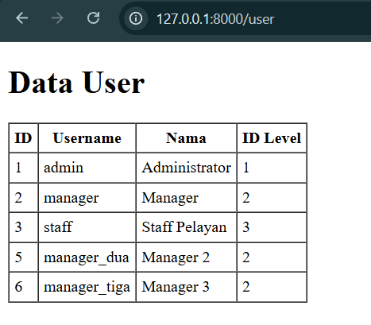

---

## Praktikum 2.1 – Retrieving Single Models

**Penjelasan:**
Eloquent menyediakan berbagai method untuk mengambil single record dari database:

- `find($id)` - Mencari berdasarkan primary key
- `first()` - Mengambil record pertama dari hasil query
- `where()` - Filtering data berdasarkan kondisi tertentu

**Contoh:**

```php
// Mencari user berdasarkan ID
$user = UserModel::find(1);

// Mencari user pertama dengan kondisi tertentu
$user = UserModel::where('username', 'admin')->first();
```

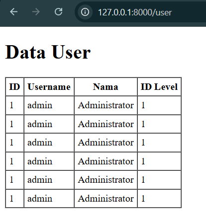

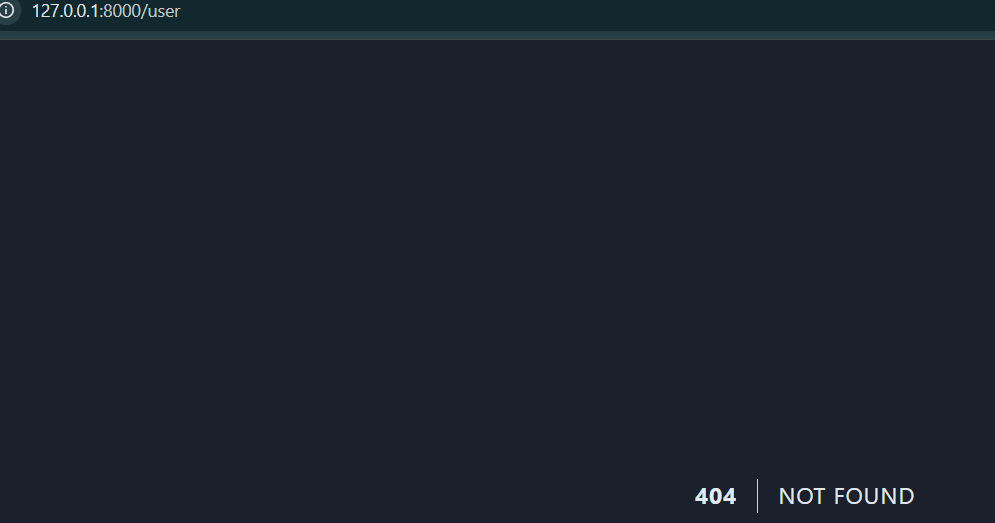

---

## Praktikum 2.2 – Not Found Exceptions

**Penjelasan:**
Method `findOrFail()` dan `firstOrFail()` akan throw exception `ModelNotFoundException` ketika data tidak ditemukan. Ini berguna untuk error handling yang lebih baik, terutama dalam routing.

**Contoh:**

```php
// Akan throw exception jika user tidak ditemukan
$user = UserModel::findOrFail($id);

// Berguna untuk route model binding
Route::get('/user/{id}', function($id) {
    $user = UserModel::findOrFail($id);
    return view('user.detail', compact('user'));
});
```

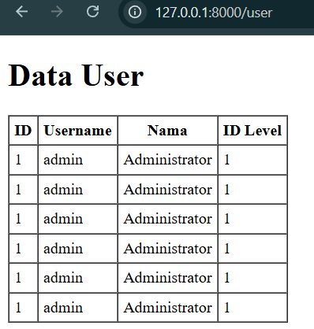

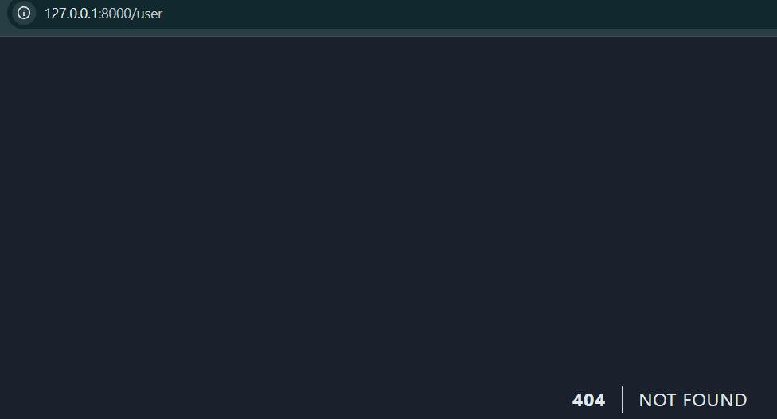

---

## Praktikum 2.3 – Retrieving Aggregates

**Penjelasan:**
Eloquent menyediakan method untuk operasi aggregate seperti `count()`, `sum()`, `avg()`, `max()`, `min()`. Method ini berguna untuk mendapatkan statistik data tanpa perlu mengambil semua record.

**Contoh:**

```php
// Menghitung jumlah user
$totalUser = UserModel::count();

// Menghitung user per level
$adminCount = UserModel::where('level_id', 1)->count();

// Aggregate lainnya
$maxId = UserModel::max('user_id');
$avgLevel = UserModel::avg('level_id');
```

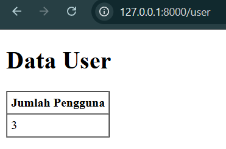

---

## Praktikum 2.4 – Retrieving or Creating Models

**Penjelasan:**
Eloquent menyediakan method untuk mencari data, dan jika tidak ditemukan akan membuat data baru:

- `firstOrCreate()` - Cari data, jika tidak ada maka create dan simpan ke database
- `firstOrNew()` - Cari data, jika tidak ada maka create instance baru (belum disimpan ke database)
- `updateOrCreate()` - Update data jika ada, create jika tidak ada

**Contoh:**

```php
// Cari atau buat user baru
$user = UserModel::firstOrCreate(
    ['username' => 'customer-1'],
    ['nama' => 'Pelanggan', 'password' => Hash::make('1234'), 'level_id' => 4]
);

// Update atau buat baru
$user = UserModel::updateOrCreate(
    ['username' => 'customer-1'],
    ['nama' => 'Pelanggan Updated']
);
```

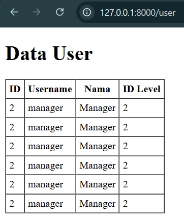

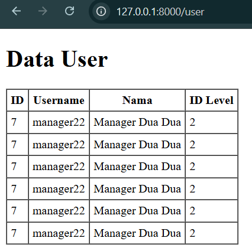

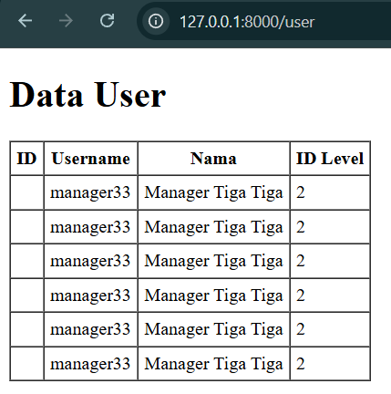

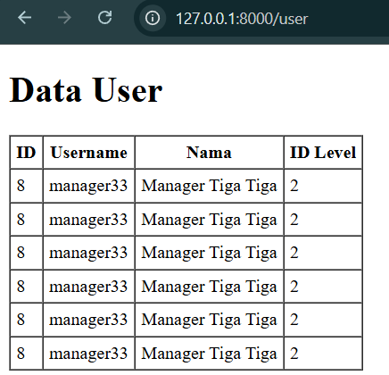

---

## Praktikum 2.5 – Attribute Changes

**Penjelasan:**
Eloquent dapat melacak perubahan pada model menggunakan method:

- `isDirty()` - Mengecek apakah ada attribute yang berubah
- `isClean()` - Mengecek apakah tidak ada perubahan
- `wasChanged()` - Mengecek apakah attribute berubah setelah save
- `getOriginal()` - Mendapatkan nilai asli sebelum perubahan

**Contoh:**

```php
$user = UserModel::find(1);
$user->username = 'admin_updated';

// Cek apakah ada perubahan
if ($user->isDirty()) {
    echo "Ada perubahan!";
}

// Lihat attribute yang berubah
$changed = $user->getDirty(); // ['username' => 'admin_updated']

$user->save();

// Cek setelah save
if ($user->wasChanged()) {
    echo "Data telah diupdate!";
}
```

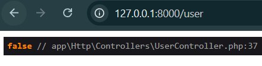

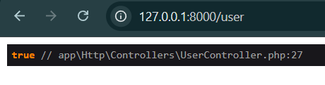

---

## Praktikum 2.6 – Create, Read, Update, Delete (CRUD)

**Penjelasan:**
Eloquent menyediakan cara yang sangat mudah untuk melakukan operasi CRUD:

**CREATE:**

```php
UserModel::create([
    'username' => 'newuser',
    'nama' => 'New User',
    'password' => Hash::make('password'),
    'level_id' => 3
]);
```

**READ:**

```php
$users = UserModel::all();
$user = UserModel::find(1);
```

**UPDATE:**

```php
$user = UserModel::find(1);
$user->nama = 'Updated Name';
$user->save();

// Atau
UserModel::where('user_id', 1)->update(['nama' => 'Updated Name']);
```

**DELETE:**

```php
$user = UserModel::find(1);
$user->delete();

// Atau
UserModel::destroy(1);
```

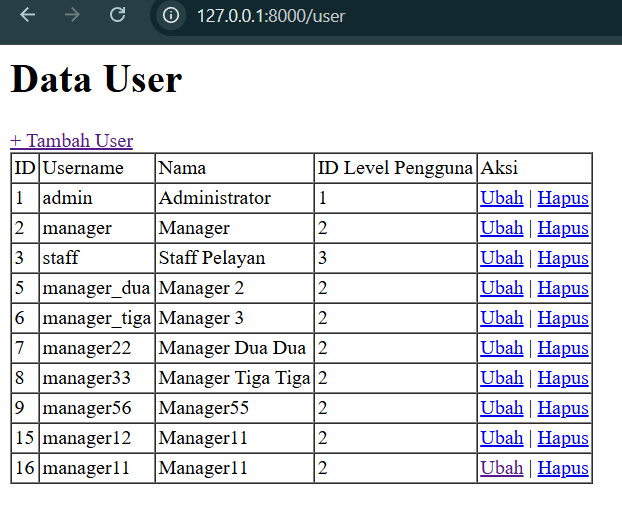

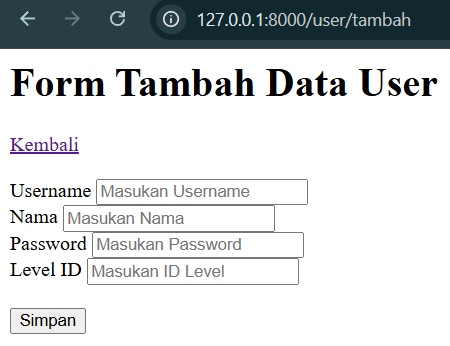

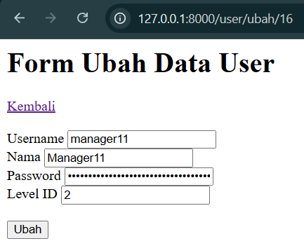

---

## Praktikum 2.7 – Relationships

**Penjelasan:**
Eloquent mendukung berbagai tipe relasi antar tabel:

- `belongsTo()` - Relasi many-to-one (user belongs to level)
- `hasMany()` - Relasi one-to-many (level has many users)
- `belongsToMany()` - Relasi many-to-many
- `hasOne()` - Relasi one-to-one

**Contoh:**

**Di Model UserModel:**

```php
public function level()
{
    return $this->belongsTo(LevelModel::class, 'level_id', 'level_id');
}
```

**Di Model LevelModel:**

```php
public function users()
{
    return $this->hasMany(UserModel::class, 'level_id', 'level_id');
}
```

**Penggunaan:**

```php
// Akses relasi
$user = UserModel::with('level')->find(1);
echo $user->level->level_nama; // Output: Administrator

// Dari sisi level
$level = LevelModel::with('users')->find(1);
foreach($level->users as $user) {
    echo $user->nama;
}
```

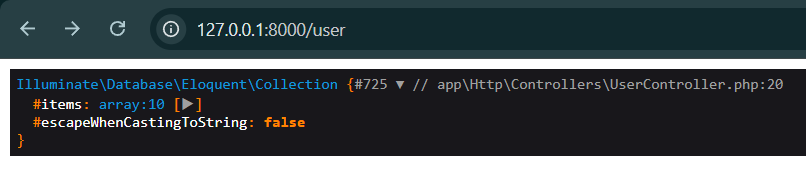

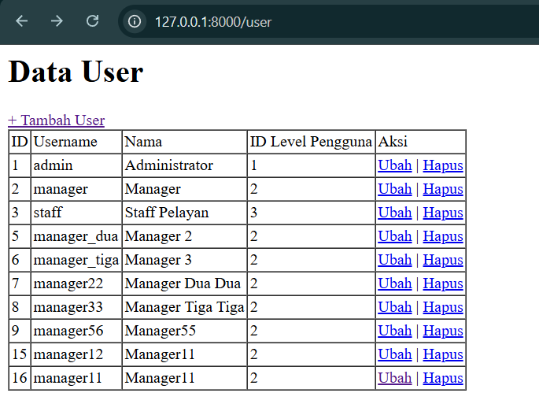

---

## Kesimpulan

Pada praktikum Week 4 ini, kita telah mempelajari:

1. ✅ Mass Assignment menggunakan `$fillable`
2. ✅ Berbagai cara retrieving data (find, first, where)
3. ✅ Exception handling dengan findOrFail
4. ✅ Aggregate functions (count, sum, avg, max, min)
5. ✅ firstOrCreate, firstOrNew, updateOrCreate
6. ✅ Tracking perubahan attribute
7. ✅ CRUD operations dengan Eloquent
8. ✅ Database relationships (belongsTo, hasMany)

---

**Praktikum oleh:**

- Nama: M. Aldyth Rafiasyah Fauzi
- NIM: 244107020179
- Kelas: TI-2F
