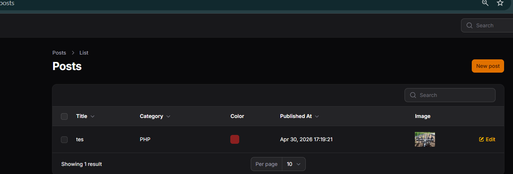

# Week 10 - Sorting, Filtering & Pagination pada Table Filament

## 📚 Topik Pembelajaran

Minggu ini fokus mempelajari:

- Implementasi Sorting (Ascending & Descending) pada Table
- Filtering data dengan berbagai kondisi
- Pagination dan default sorting
- Best practices untuk data table yang optimal

---

## 📝 JS 10 - Implementasi Sorting (Ascending & Descending) pada Table Filament

### Penjelasan:

Sorting adalah fitur penting untuk mengorganisir data dalam table. User dapat mengklik header kolom untuk mengurutkan data ascending atau descending. Filament menyediakan method `sortable()` untuk mengaktifkan sorting pada kolom, dan `defaultSort()` untuk mengatur urutan default saat table pertama kali dimuat.

**Konsep Sorting:**

#### 1. Membuat Table dengan Sorting (PostsTable.php)

```php
<?php

namespace App\Filament\Resources\Posts\Tables;

use Filament\Actions\BulkActionGroup;
use Filament\Actions\DeleteBulkAction;
use Filament\Actions\EditAction;
use Filament\Tables\Table;
use Filament\Tables\Columns\TextColumn;
use Filament\Tables\Columns\ColorColumn;
use Filament\Tables\Columns\ImageColumn;

class PostsTable
{
    public static function configure(Table $table): Table
    {
        return $table
            ->columns([
                TextColumn::make('title')
                    ->searchable()
                    ->sortable(), // Kolom title bisa di-sort
                
                TextColumn::make('category.name')
                    ->label('Category')
                    ->searchable()
                    ->sortable(), // Sorting pada relasi
                
                ColorColumn::make('color'),
                
                TextColumn::make('published_at')
                    ->dateTime()
                    ->label('Published At')
                    ->sortable(), // Sorting pada datetime
                
                ImageColumn::make('image')
                    ->disk('public')
                    ->label('Image'),
            ])
            ->defaultSort('published_at', 'asc') // Default sort: published_at ascending
            ->filters([
                //
            ])
            ->recordActions([
                EditAction::make(),
            ])
            ->toolbarActions([
                BulkActionGroup::make([
                    DeleteBulkAction::make(),
                ]),
            ]);
    }
}
```

#### 2. Advanced Sorting dengan ProductsTable.php

```php
<?php

namespace App\Filament\Resources\Products\Tables;

use Filament\Actions\BulkActionGroup;
use Filament\Actions\DeleteBulkAction;
use Filament\Actions\EditAction;
use Filament\Actions\ViewAction;
use Filament\Tables\Table;
use Filament\Tables\Columns\TextColumn;
use Filament\Tables\Columns\ImageColumn;

class ProductsTable
{
    public static function configure(Table $table): Table
    {
        return $table
            ->columns([
                TextColumn::make('name')
                    ->sortable()
                    ->searchable(),
                
                TextColumn::make('sku')
                    ->sortable()
                    ->badge()
                    ->color('success'),
                
                TextColumn::make('price')
                    ->sortable()
                    ->numeric()
                    ->formatStateUsing(fn ($state) => 'Rp ' . number_format($state, 0, ',', '.')),
                
                TextColumn::make('stock')
                    ->sortable()
                    ->badge()
                    ->color(fn ($state) => $state < 10 ? 'danger' : 'success'),
                
                ImageColumn::make('image')
                    ->disk('public')
            ])
            ->defaultSort('name', 'asc') // Default: sort by name ascending
            ->filters([
                //
            ])
            ->recordActions([
                ViewAction::make(),
                EditAction::make(),
            ])
            ->toolbarActions([
                BulkActionGroup::make([
                    DeleteBulkAction::make(),
                ]),
            ]);
    }
}
```

### Screenshot:



**Hasil:**

- ✅ Sorting pada kolom text, datetime, numeric
- ✅ Sorting pada relasi (category.name)
- ✅ Default sort ascending/descending
- ✅ User dapat toggle sort order dengan click header

### 📌 Analisis & Diskusi

**Q1: Mengapa sorting penting pada admin panel?**

Sorting adalah fitur fundamental untuk UX yang baik:

1. **Data Organization**: User dapat menemukan data lebih cepat dengan urutan yang diinginkan
2. **Business Logic**: Sorting by price, date, atau status membantu prioritaskan tindakan
3. **Decision Making**: Menampilkan data terbaru/tertinggi duluan membantu decision making
4. **Standard Practice**: User sudah terbiasa expect sorting pada setiap table

```php
// Contoh use case sorting:
// - Sort by published_at DESC: Lihat post terbaru duluan
// - Sort by price ASC: Lihat produk termurah duluan
// - Sort by stock ASC: Lihat produk habis duluan (prioritas restock)
// - Sort by created_at DESC: Lihat user terbaru daftar
```

**Q2: Apa perbedaan `sortable()` biasa dengan `defaultSort()`?**

| Aspek | sortable() | defaultSort() |
|-------|-----------|---------------|
| **Fungsi** | Mengaktifkan sorting per kolom | Mengatur urutan saat table load |
| **Scope** | Untuk satu kolom saja | Untuk seluruh table |
| **Kontrol User** | User bisa mengubah sort | Hanya initial order |
| **Multiple** | Banyak kolom bisa sortable | Hanya satu kolom default |
| **Lokasi** | Di TextColumn/Column component | Di configure table |

```php
// sortable() - per column
TextColumn::make('title')
    ->sortable() // User bisa click header untuk sort title

// defaultSort() - global table
->defaultSort('published_at', 'asc')
// Table mula-mula tampil sorted by published_at ascending
// Tapi user tetap bisa sort ke kolom lain
```

**Q3: Mengapa relasi tetap bisa di-sort?**

Filament secara otomatis handle sorting pada relasi menggunakan join query:

```php
// Sorting by relation
TextColumn::make('category.name')
    ->sortable()

// Di background, Filament generate query seperti:
// SELECT posts.* FROM posts
// LEFT JOIN categories ON posts.category_id = categories.id
// ORDER BY categories.name ASC

// Jadi meski 'category.name' adalah relasi, sorting tetap bisa
```

**Q4: Kapan kita menggunakan `desc` sebagai default?**

Gunakan `desc` (descending) sebagai default dalam kasus:

```php
// ✅ Gunakan desc
->defaultSort('published_at', 'desc') // Terbaru duluan (blog, news)
->defaultSort('created_at', 'desc')    // User baru duluan
->defaultSort('updated_at', 'desc')    // Perubahan terakhir duluan
->defaultSort('price', 'desc')         // Harga tertinggi duluan (luxury products)
->defaultSort('views', 'desc')         // Paling populer duluan

// ✅ Gunakan asc
->defaultSort('stock', 'asc')          // Stok terendah duluan (restock priority)
->defaultSort('name', 'asc')           // Alphabetical order
->defaultSort('priority', 'asc')       // Low priority duluan
```

---

## 🎯 Key Takeaways

1. **Sortable()** - Method untuk mengaktifkan sorting per kolom
2. **DefaultSort()** - Method untuk mengatur urutan default table
3. **Relasi** - Bisa di-sort menggunakan dot notation (category.name)
4. **User Experience** - Sorting meningkatkan usability dan decision making
5. **Best Practice** - Tentukan default sort yang sesuai dengan use case bisnis