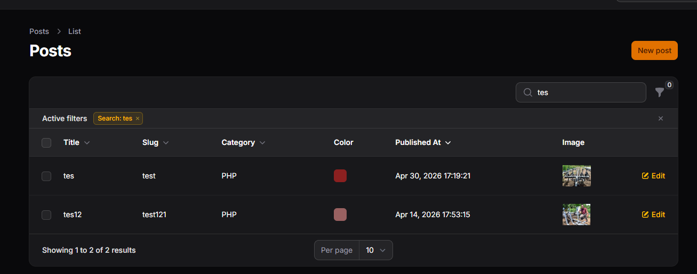
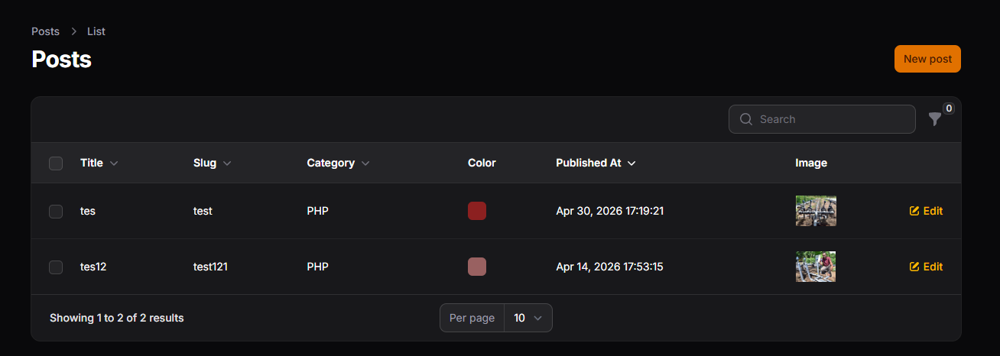
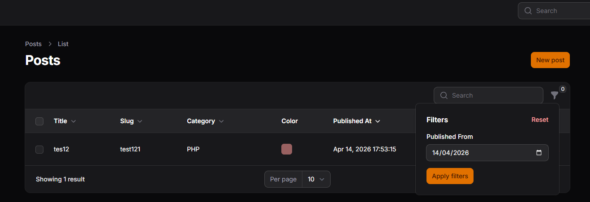
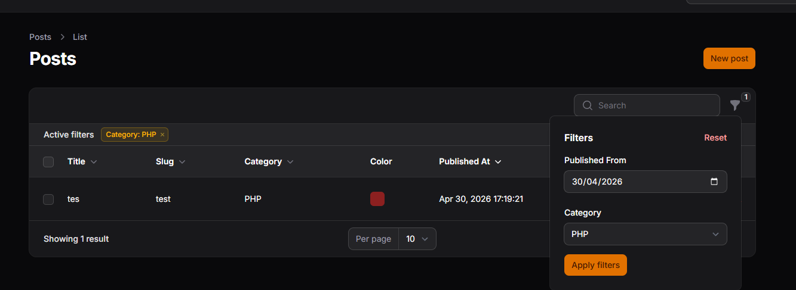

# Week 11 - Search & Filter pada Table Filament

## 📚 Topik Pembelajaran

Minggu ini fokus mempelajari:

- Implementasi Search (searchable) pada kolom table
- Implementasi Filter (Filter, SelectFilter, etc)
- Custom filter dengan query builder
- Kombinasi search + filter + sort untuk data discovery optimal

---

## 📝 JS 11 - Implementasi Search & Filter pada Table Filament

### Penjelasan:

Search dan Filter adalah fitur essential untuk menemukan data dalam table yang besar. Search mencari berdasarkan text partial match pada kolom tertentu, sedangkan Filter menyaring data berdasarkan kondisi spesifik (tanggal, kategori, status, dll). Kombinasi keduanya memberikan user pengalaman data discovery yang optimal.

**Konsep Search & Filter:**

#### 1. Membuat Table dengan Search dan Filter (PostsTable.php)

```php
<?php

namespace App\Filament\Resources\Posts\Tables;

use Filament\Actions\BulkActionGroup;
use Filament\Actions\DeleteBulkAction;
use Filament\Actions\EditAction;
use Filament\Tables\Table;
use Filament\Tables\Columns\TextColumn;
use Filament\Tables\Columns\ColorColumn;
use Filament\Tables\Columns\ImageColumn;
use Filament\Tables\Filters\Filter;
use Filament\Tables\Filters\SelectFilter;
use Filament\Forms\Components\DatePicker;

class PostsTable
{
    public static function configure(Table $table): Table
    {
        return $table
            ->columns([
                TextColumn::make('title')
                    ->searchable() // User bisa search by title
                    ->sortable(),

                TextColumn::make('slug')
                    ->searchable() // User bisa search by slug
                    ->sortable(),

                TextColumn::make('category.name')
                    ->label('Category')
                    ->searchable() // Search pada relasi
                    ->sortable(),

                ColorColumn::make('color'),

                TextColumn::make('published_at')
                    ->dateTime()
                    ->label('Published At')
                    ->sortable(),

                ImageColumn::make('image')
                    ->disk('public')
                    ->label('Image'),
            ])
            ->defaultSort('published_at', 'asc')
            ->filters([
                // Filter 1: Date Range Filter
                Filter::make('published_at')
                    ->form([
                        DatePicker::make('published_at')
                            ->label('Published From'),
                    ])
                    ->query(function ($query, $data) {
                        return $query->when(
                            $data['published_at'],
                            fn ($query, $date) => $query->whereDate('published_at', $date)
                        );
                    }),

                // Filter 2: Category Select Filter
                SelectFilter::make('category_id')
                    ->label('Category')
                    ->relationship('category', 'name') // Relasi ke category
                    ->preload(),
            ])
            ->recordActions([
                EditAction::make(),
            ])
            ->toolbarActions([
                BulkActionGroup::make([
                    DeleteBulkAction::make(),
                ]),
            ]);
    }
}
```

#### 2. Advanced Filter dengan Multiple Conditions

```php
// Contoh filter yang lebih kompleks

use Filament\Tables\Filters\TernaryFilter;
use Filament\Tables\Filters\MultiSelectFilter;

->filters([
    // Simple Text Search
    Filter::make('title')
        ->form([
            TextInput::make('title')
                ->placeholder('Search by title...'),
        ])
        ->query(function ($query, $data) {
            return $query->when(
                $data['title'],
                fn ($query, $title) => $query->where('title', 'like', "%{$title}%")
            );
        }),

    // Ternary Filter (Yes/No/Both)
    TernaryFilter::make('published')
        ->label('Published')
        ->attribute('published'),

    // Multi Select Filter
    MultiSelectFilter::make('status')
        ->options([
            'draft' => 'Draft',
            'published' => 'Published',
            'archived' => 'Archived',
        ]),

    // Date Range Filter
    Filter::make('date_range')
        ->form([
            DatePicker::make('from_date'),
            DatePicker::make('to_date'),
        ])
        ->query(function ($query, $data) {
            return $query
                ->when(
                    $data['from_date'],
                    fn ($q) => $q->whereDate('published_at', '>=', $data['from_date'])
                )
                ->when(
                    $data['to_date'],
                    fn ($q) => $q->whereDate('published_at', '<=', $data['to_date'])
                );
        }),
])
```

### Screenshot:






**Hasil:**

- ✅ Search pada text columns dan relasi
- ✅ Filter dengan date picker, select, ternary
- ✅ Custom query conditions dengan when()
- ✅ Multiple filters dapat dikombinasikan

### 📌 Analisis & Diskusi

**Q1: Mengapa search tidak cocok untuk filter tanggal?**

Search menggunakan LIKE query yang tidak cocok untuk tanggal:

```php
// ❌ SALAH - Search untuk tanggal
TextColumn::make('published_at')
    ->searchable() // WHERE published_at LIKE '%2026-04-30%'
    // Hasilnya tidak akurat, perlu exact match

// ✅ BENAR - Filter untuk tanggal
Filter::make('published_at')
    ->form([
        DatePicker::make('published_at'),
    ])
    ->query(function ($query, $data) {
        return $query->when(
            $data['published_at'],
            fn ($query, $date) => $query->whereDate('published_at', $date)
        );
    })
    // Menggunakan whereDate() untuk perbandingan exact

// Perbedaan query:
// Search: WHERE published_at LIKE '%...'
// Filter: WHERE DATE(published_at) = '2026-04-30'
```

**Q2: Apa fungsi `relationship()` pada SelectFilter?**

`relationship()` mengisi dropdown select dengan data dari relasi terkait:

```php
// Contoh: Filter category
SelectFilter::make('category_id')
    ->label('Category')
    ->relationship('category', 'name') // Load dari relasi
    ->preload()

// Breakdown:
// - 'category_id' = nama field di database (foreign key)
// - 'category' = nama method relasi di model
// - 'name' = field yang ditampilkan di dropdown

// Di background Filament generate:
// SELECT DISTINCT id, name FROM categories ORDER BY name
// Kemudian populate ke select options

// Contoh lain:
SelectFilter::make('author_id')
    ->relationship('author', 'full_name')
    // Tampilkan dropdown dengan nama author
```

**Q3: Mengapa kita perlu `whereDate()` pada query filter?**

`whereDate()` memastikan perbandingan tanggal yang akurat tanpa mempertimbangkan waktu:

```php
// ❌ SALAH - WHERE published_at = '2026-04-30'
// Hanya match published_at tepat jam 00:00:00
// Data dengan jam lain tidak match

// ✅ BENAR - WHERE DATE(published_at) = '2026-04-30'
// Match semua data tanggal 2026-04-30 regardless of time
// 2026-04-30 10:30:45 ✓ Match
// 2026-04-30 23:59:59 ✓ Match
// 2026-04-30 00:00:00 ✓ Match

// Database:
// published_at: 2026-04-30 14:30:45

// Query tanpa DATE():
// WHERE published_at = '2026-04-30' // ❌ No match

// Query dengan DATE():
// WHERE DATE(published_at) = '2026-04-30' // ✅ Match!
```

**Q4: Apa perbedaan `searchable()` dan `filters()`?**

| Aspek           | Searchable                | Filters                         |
| --------------- | ------------------------- | ------------------------------- |
| **Fungsi**      | Text search partial match | Exact/range filtering           |
| **Type**        | Text only                 | Banyak type (date, select, etc) |
| **Performance** | Slower (LIKE query)       | Faster (exact match)            |
| **UI**          | Top search box            | Filter button/sidebar           |
| **Use Case**    | Find by keyword           | Find by category/status/date    |
| **Query**       | LIKE                      | WHERE/BETWEEN                   |

```php
// Searchable - text search
TextColumn::make('title')
    ->searchable()
// Query: WHERE title LIKE '%user input%'
// UI: Single search box di atas table
// Use case: "Find post with title containing 'Laravel'"

// Filters - structured filtering
Filter::make('published_at')
    ->form([DatePicker::make('published_at')])
// Query: WHERE DATE(published_at) = ?
// UI: Filter button, opens modal
// Use case: "Find posts published on specific date"

// Best practice: Kombinasikan keduanya
->columns([
    TextColumn::make('title')->searchable(), // Search by text
])
->filters([
    Filter::make('date'),           // Filter by date
    SelectFilter::make('category'), // Filter by category
])
```

---

## 🎯 Key Takeaways

1. **Searchable()** - Untuk mencari data berdasarkan text/keyword
2. **Filter** - Untuk menyaring data berdasarkan kondisi spesifik
3. **Relationship Filter** - Gunakan `relationship()` untuk populate dari relasi
4. **whereDate()** - Penting untuk filter tanggal yang akurat
5. **Kombinasi** - Search + Filter + Sort = optimal data discovery experience
