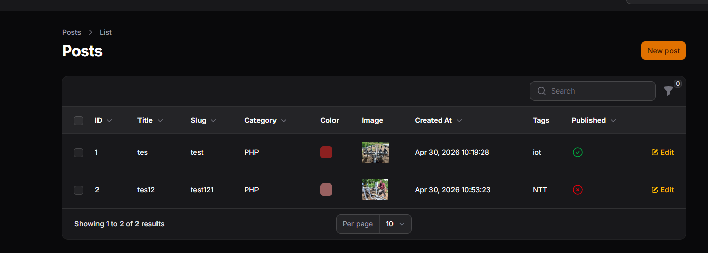
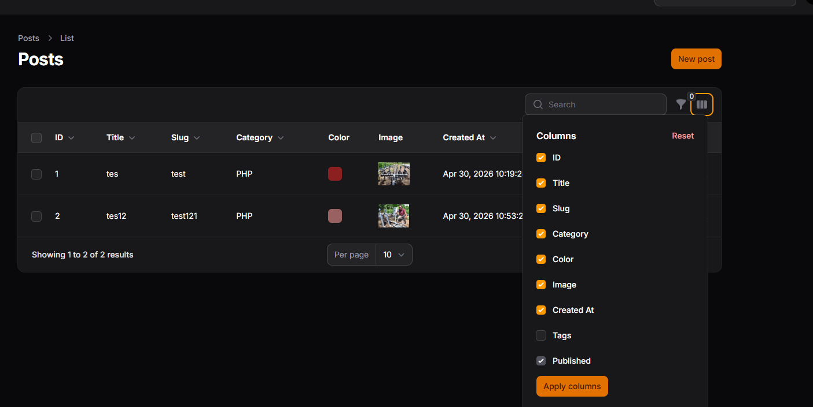

# Week 12 - Toggle Column pada Table Filament

## 👤 Identitas Mahasiswa

- **Nama:** M. Aldyth Rafiasyah Fauzi
- **NIM:** 244107020179
- **Kelas:** TI-2F

---

## 📚 Topik Pembelajaran

Minggu ini fokus mempelajari:

1. Menambahkan kolom baru pada tabel Filament
2. Menggunakan IconColumn untuk boolean
3. Mengaktifkan fitur toggleable() pada kolom
4. Mengatur kolom agar tersembunyi secara default
5. Memahami cara kerja penyimpanan preferensi kolom (session)

---

## 📝 JS 12 - Implementasi Toggle Column pada Table Filament

### Penjelasan:

Toggle Column memungkinkan user untuk mengatur kolom mana saja yang ingin ditampilkan atau disembunyikan pada tabel. Fitur ini sangat berguna untuk tabel dengan banyak kolom karena memberikan fleksibilitas kepada user untuk melihat hanya data yang mereka butuhkan. Filament menyediakan fitur `toggleable()` untuk setiap kolom yang dapat di-toggle, dan `toggledHiddenByDefault()` untuk menyembunyikan kolom secara default.

**Fitur yang dipelajari:**

#### 1. Implementasi Toggle Column pada Table

```php
// filepath: app/Filament/Resources/Products/Pages/ListProducts.php

use Filament\Tables;
use Filament\Tables\Table;
use Filament\Tables\Columns\TextColumn;
use Filament\Tables\Columns\ImageColumn;
use Filament\Tables\Columns\BadgeColumn;
use Filament\Tables\Columns\IconColumn;

public function table(Table $table): Table
{
    return $table
        ->columns([
            TextColumn::make('name')
                ->label('Nama Produk')
                ->sortable()
                ->searchable()
                ->toggleable(),

            TextColumn::make('category.name')
                ->label('Kategori')
                ->sortable()
                ->toggleable(),

            TextColumn::make('description')
                ->label('Deskripsi')
                ->limit(50)
                ->toggleable()
                ->toggledHiddenByDefault(),

            TextColumn::make('price')
                ->label('Harga')
                ->money('IDR')
                ->sortable()
                ->toggleable(),

            TextColumn::make('stock')
                ->label('Stok')
                ->sortable()
                ->toggleable(),

            BadgeColumn::make('status')
                ->label('Status')
                ->colors([
                    'success' => 'available',
                    'danger' => 'out_of_stock',
                ])
                ->sortable()
                ->toggleable(),

            IconColumn::make('is_featured')
                ->label('Featured')
                ->boolean()
                ->toggleable()
                ->toggledHiddenByDefault(),

            ImageColumn::make('image')
                ->label('Gambar')
                ->toggleable()
                ->toggledHiddenByDefault()
                ->square(),

            TextColumn::make('created_at')
                ->label('Dibuat')
                ->dateTime('d/m/Y H:i')
                ->sortable()
                ->toggleable()
                ->toggledHiddenByDefault(),
        ])
        ->defaultSort('created_at', 'desc')
        ->filters([
            // ...filters
        ])
        ->actions([
            // ...actions
        ])
        ->bulkActions([
            // ...bulk actions
        ]);
}
```

### Screenshot:





**Hasil:**

- ✅ Toggle Column button di toolbar table
- ✅ Kolom dapat di-show/hide sesuai preferensi user
- ✅ Beberapa kolom hidden by default (description, image, created_at, is_featured)
- ✅ User preferences tersimpan per session
- ✅ IconColumn untuk boolean fields (is_featured)

---

## 📌 Analisis & Diskusi

**Q1: Mengapa toggle column penting pada admin panel?**

Toggle Column memberikan user control atas tampilan tabel sesuai kebutuhan mereka. Keuntungannya:

1. **Reduce Cognitive Load**: Tabel dengan banyak kolom bisa overwhelming. User bisa fokus hanya pada kolom yang relevan.
2. **Responsive Design**: Di layar kecil, user bisa sembunyikan kolom yang tidak penting untuk hemat space.
3. **Personalization**: Setiap user punya preferensi berbeda tentang kolom mana yang penting.
4. **Performance**: Render kolom lebih sedikit = loading lebih cepat.

```php
// Bad - Terlalu banyak kolom visible sekaligus
TextColumn::make('name'),
TextColumn::make('email'),
TextColumn::make('phone'),
TextColumn::make('address'),
TextColumn::make('notes'),
// ... lebih banyak lagi, user overwhelmed!

// Good - Toggleable dengan smart defaults
TextColumn::make('name')->toggleable(),
TextColumn::make('email')->toggleable(),
TextColumn::make('phone')->toggleable()->toggledHiddenByDefault(),
TextColumn::make('address')->toggleable()->toggledHiddenByDefault(),
// ... user bisa customize visibility
```

**Q2: Apa perbedaan toggleable() biasa dengan toggledHiddenByDefault()?**

| Aspek             | `toggleable()`                               | `toggledHiddenByDefault()`                        |
| ----------------- | -------------------------------------------- | ------------------------------------------------- |
| **Fungsi**        | Membuat kolom bisa di-toggle                 | Menyembunyikan kolom saat pertama load            |
| **Penggunaan**    | Wajib untuk semua kolom yang ingin di-toggle | Optional, hanya untuk kolom jarang digunakan      |
| **Kombinasi**     | Standalone bisa                              | Harus digabung dengan `toggleable()`              |
| **Default State** | Kolom visible                                | Kolom hidden                                      |
| **Use Case**      | Semua kolom yang bisa di-customize           | Kolom tambahan seperti timestamps, internal notes |

```php
// Hanya toggleable() - visible by default, user bisa hide
TextColumn::make('name')->toggleable(),

// toggleable() + toggledHiddenByDefault() - hidden by default, user bisa show
TextColumn::make('internal_notes')->toggleable()->toggledHiddenByDefault(),
```

**Q3: Bagaimana cara kerja penyimpanan preferensi kolom di Filament?**

Preferensi kolom tersimpan di **session** (temporary, hilang saat logout) secara default:

1. **Session Storage**: Filament menyimpan kolom mana yang di-hide/show di session user
2. **Per User Basis**: Setiap user punya preferensi sendiri
3. **Temporary**: Hilang saat user logout atau session expired
4. **No Database Query**: Lebih cepat karena tidak perlu query database

```php
// Default - Session (temporary, hilang saat logout)
TextColumn::make('name')->toggleable(),

// Untuk persistent ke database, perlu custom implementation:
// 1. Buat table user_column_preferences
// 2. Listen ke event toggle dari frontend
// 3. Simpan ke database setiap kali toggle
// 4. Load preferences saat user akses halaman

// Alternative: Gunakan localStorage di frontend (belum built-in di Filament)
```

**Q4: Kapan gunakan IconColumn vs TextColumn untuk boolean?**

| Aspek             | IconColumn                  | TextColumn                  |
| ----------------- | --------------------------- | --------------------------- |
| **Visual**        | Icon (checkmark, cross)     | Text (Yes, No, True, False) |
| **Space**         | Compact, hemat space        | Lebih lebar                 |
| **Scanning**      | Lebih cepat visual scanning | Perlu baca text             |
| **Accessibility** | Perlu label tooltip         | Self-explanatory            |
| **Mobile**        | Cocok untuk responsive      | Perlu adjust                |

```php
// IconColumn - untuk boolean fields
IconColumn::make('is_featured')
    ->boolean()
    ->toggleable(),

// TextColumn - untuk status text
TextColumn::make('status')
    ->toggleable(),
```

---

## 📌 Key Takeaways

1. **Menambahkan Kolom Baru** = Gunakan TextColumn, BadgeColumn, IconColumn, ImageColumn sesuai tipe data
2. **IconColumn untuk Boolean** = Compact dan visual, lebih cepat scanning
3. **toggleable()** = Membuat kolom bisa di-toggle, visible by default
4. **toggledHiddenByDefault()** = Menyembunyikan kolom yang jarang digunakan
5. **Session Storage** = Preferensi tersimpan di session, tidak permanent di database

---
