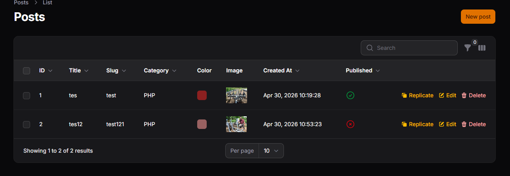
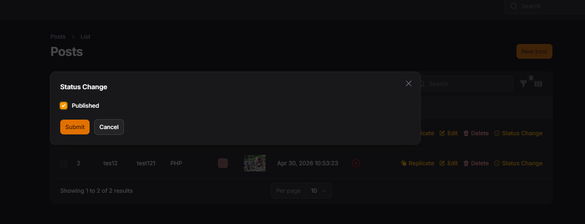

# Week 13 - Table Actions & Custom Action di Filament

## 👤 Identitas Mahasiswa

- **Nama:** M. Aldyth Rafiasyah Fauzi
- **NIM:** 244107020179
- **Kelas:** TI-2F

---

## 📚 Topik Pembelajaran

Minggu ini fokus mempelajari:

1. Implementasi Table Actions (Edit, Delete, View)
2. Membuat Custom Action pada tabel
3. Action dengan Modal & Form
4. Menambahkan validasi dalam custom action

---

## 📝 JS 13 - Implementasi Table Actions & Custom Action di Filament

### Penjelasan:

Table Actions memungkinkan user melakukan operasi langsung pada baris tabel tanpa harus membuka halaman terpisah. Filament menyediakan predefined actions (Edit, Delete, View) dan kemampuan untuk membuat custom action sesuai kebutuhan. Custom action dapat menampilkan modal, form, atau trigger action tertentu dengan modal confirmation.

**Fitur yang dipelajari:**

#### 1. Custom Action dengan Modal & Form

````php
// Custom action dengan form modal untuk toggle status
Action::make('status')
    ->label('Status Change')
    ->icon('heroicon-o-check-circle')
    ->schema([
        Checkbox::make('published')
            ->default(fn ($record): bool => $record->published)
    ])
    ->action(function ($record, $data) {
        $record->update([
            'published' => $data['published'],
        ]);
    }),
````

### Screenshot:





**Hasil:**

- ✅ View, Edit, Delete actions tersedia
- ✅ Replicate action untuk duplicate record
- ✅ Custom publish/unpublish actions
- ✅ Custom actions dengan modal form
- ✅ Validation pada custom action

---

## 📌 Analisis & Diskusi

**Q1: Mengapa action di tabel lebih efisien dibanding halaman edit?**

Action di tabel memberikan beberapa keuntungan:

1. **Tidak perlu navigasi** = User tidak perlu membuka halaman baru, langsung action dari tabel
2. **Konteks tetap** = User tetap lihat data di tabel, tidak kehilangan konteks
3. **Bulk operations** = Bisa operasi multiple records sekaligus (bulk action)
4. **Faster workflow** = Mengurangi klik dan page loading
5. **Better UX** = Inline actions lebih intuitif untuk operasi cepat

```php
// Bad - User harus buka halaman edit terpisah
// Click row → go to edit page → make changes → go back

// Good - Action langsung dari tabel
// Click action button → modal/inline edit → submit → done, tetap di tabel
```

**Q2: Apa perbedaan predefined action dan custom action?**

| Aspek             | Predefined Action             | Custom Action                      |
| ----------------- | ----------------------------- | ---------------------------------- |
| **Contoh**        | Edit, Delete, View, Replicate | Publish, Archive, Send Email, etc. |
| **Setup**         | Built-in, langsung pakai      | Perlu definisikan logic sendiri    |
| **Fleksibilitas** | Terbatas                      | Unlimited, sesuai kebutuhan        |
| **Use Case**      | CRUD dasar                    | Business logic khusus              |
| **Konfirmasi**    | Ada default                   | Bisa custom atau tanpa             |

```php
// Predefined - simple, built-in
EditAction::make(),
DeleteAction::make(),

// Custom - sesuai business logic
Action::make('publish')
    ->action(fn ($record) => $record->publish()),
Action::make('sendNotification')
    ->action(fn ($record) => $record->notifyUsers()),
```

**Q3: Bagaimana cara menambahkan validasi dalam custom action?**

Validasi dalam custom action bisa dilakukan di form atau di dalam action logic:

```php
// Validasi 1: Di Form (client-side & server-side)
Action::make('schedule')
    ->form([
        DateTimePicker::make('scheduled_at')
            ->required()
            ->minDate(now()->addHours(1))
            ->rules(['required', 'date', 'after:now']),
    ]),

// Validasi 2: Di Action Logic (server-side)
->action(function ($record, array $data) {
    // Validasi business logic
    if ($record->status === 'published') {
        Notification::make()->danger()->title('Error')->send();
        return;
    }

    // Update jika valid
    $record->update($data);
}),
```

**Q4: Kapan kita menggunakan Replicate?**

Replicate action digunakan untuk membuat duplikat record dengan opsi customize:

| Use Case               | Contoh                                       |
| ---------------------- | -------------------------------------------- |
| **Template Records**   | Copy produk dengan spesifikasi sama          |
| **Recurring Items**    | Duplicate post/artikel untuk publikasi baru  |
| **Configuration Copy** | Copy setting/template dengan modifikasi      |
| **Data Template**      | Create dari existing record sebagai template |

```php
// Replicate dengan excludes & modifications
ReplicateAction::make()
    ->excludeAttributes(['slug', 'published_at', 'views_count'])
    ->beforeReplicaCreated(function ($data) {
        $data['title'] = $data['title'] . ' (Copy)';
        $data['status'] = 'draft';
    })
```

---

## 📌 Key Takeaways

1. **Table Actions** = Operasi langsung dari tabel tanpa navigasi halaman baru
2. **Predefined Actions** = Edit, Delete, View, Replicate - built-in dan siap pakai
3. **Custom Actions** = Action sesuai business logic dengan modal/form dan validasi
4. **Validasi Multi-level** = Form validation + logic validation untuk keamanan
5. **Replicate** = Duplicate record dengan opsi exclude attributes dan modify data

---
