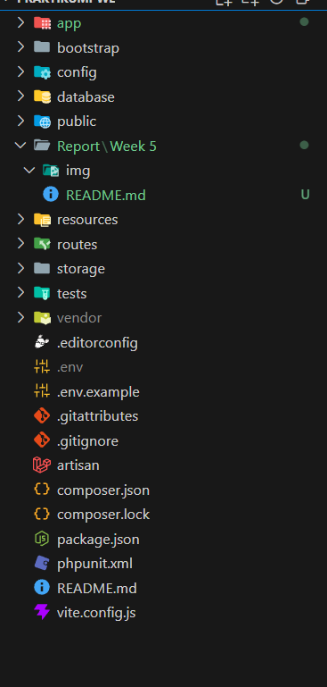
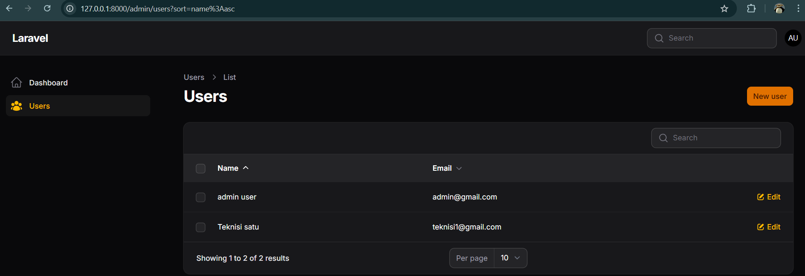
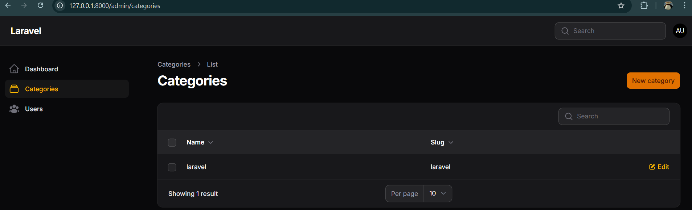

# Week 5 - MODEL dan ELOQUENT ORM dengan Filament

## 📚 Topik Pembelajaran

Minggu ini fokus mempelajari:

- Instalasi dan setup Filament PHP Admin Panel
- Membuat CRUD Resource dengan Filament
- Migration, Model, dan Relasi Database
- Resource Management untuk Category dan Post

---

## 📝 JS 1 - Instalasi dan Setup Filament PHP

### Penjelasan:

Filament adalah admin panel builder yang powerful untuk Laravel. Pada tahap ini, kita melakukan instalasi awal dan konfigurasi environment untuk menggunakan Filament di project Laravel.

**Langkah-langkah instalasi:**

#### 1. Install Filament melalui Composer

```bash
composer require filament/filament:"^3.0" -W
```

#### 2. Publikasi Assets Filament

```bash
php artisan filament:install --panels=admin
```

#### 3. Buat Admin User (jika diperlukan)

```bash
php artisan make:filament-user
```

### Screenshot:



**Hasil:** Environment siap dengan Filament terinstal dan dapat diakses melalui `/admin`

---

## 📝 JS 2 - Membuat CRUD Resource dengan Filament

### Penjelasan:

Resource adalah abstraksi dari model database yang memungkinkan Filament untuk secara otomatis generate halaman CRUD (Create, Read, Update, Delete). Ini mengurangi boilerplate code secara signifikan.

**Membuat Resource:**

#### 1. Generate Resource Class

```bash
php artisan make:filament-resource Post
```

#### 2. Contoh Struktur Resource (app/Filament/Resources/PostResource.php)

```php
<?php

namespace App\Filament\Resources;

use App\Filament\Resources\PostResource\Pages;
use App\Models\Post;
use Filament\Forms\Form;
use Filament\Resources\Resource;
use Filament\Tables\Table;
use Filament\Tables\Columns\TextColumn;
use Filament\Forms\Components\TextInput;
use Filament\Forms\Components\Textarea;

class PostResource extends Resource
{
    protected static ?string $model = Post::class;

    public static function form(Form $form): Form
    {
        return $form
            ->schema([
                TextInput::make('title')
                    ->required()
                    ->maxLength(255),
                Textarea::make('content')
                    ->required(),
            ]);
    }

    public static function table(Table $table): Table
    {
        return $table
            ->columns([
                TextColumn::make('id'),
                TextColumn::make('title'),
                TextColumn::make('created_at'),
            ])
            ->filters([])
            ->actions([])
            ->bulkActions([]);
    }
}
```

### Screenshot:



**Hasil:** Halaman CRUD otomatis untuk Post dengan form validation dan data table

---

## 📝 JS 3 - Membuat Migration, Model, Relasi & Resource Category

### Penjelasan:

Tahap ini mencakup pembuatan struktur database (migration), model Eloquent, relasi antar model, dan resource untuk mengelola Category. Category akan memiliki relasi One-to-Many dengan Post.

### A. Membuat Migration dan Model

#### 1. Generate Migration dan Model

```bash
php artisan make:model Category -m
php artisan make:model Post -m
```

#### 2. Migration Categories (database/migrations/xxxx_create_categories_table.php)

```php
Schema::create('categories', function (Blueprint $table) {
    $table->id();
    $table->string('name')->unique();
    $table->string('slug')->unique();
    $table->text('description')->nullable();
    $table->timestamps();
});
```

#### 3. Migration Posts (database/migrations/xxxx_create_posts_table.php)

```php
Schema::create('posts', function (Blueprint $table) {
    $table->id();
    $table->foreignId('category_id')->constrained()->onDelete('cascade');
    $table->string('title');
    $table->text('content');
    $table->timestamps();
});
```

### B. Membuat Model dan Relasi

#### 1. Model Category (app/Models/Category.php)

```php
<?php

namespace App\Models;

use Illuminate\Database\Eloquent\Model;
use Illuminate\Database\Eloquent\Relations\HasMany;

class Category extends Model
{
    protected $fillable = ['name', 'slug', 'description'];

    public function posts(): HasMany
    {
        return $this->hasMany(Post::class);
    }
}
```

#### 2. Model Post (app/Models/Post.php)

```php
<?php

namespace App\Models;

use Illuminate\Database\Eloquent\Model;
use Illuminate\Database\Eloquent\Relations\BelongsTo;

class Post extends Model
{
    protected $fillable = ['category_id', 'title', 'content'];

    public function category(): BelongsTo
    {
        return $this->belongsTo(Category::class);
    }
}
```

### C. Membuat Resource Category

#### 1. Generate Resource

```bash
php artisan make:filament-resource Category
```

#### 2. CategoryResource (app/Filament/Resources/CategoryResource.php)

```php
<?php

namespace App\Filament\Resources;

use App\Filament\Resources\CategoryResource\Pages;
use App\Models\Category;
use Filament\Forms\Form;
use Filament\Forms\Components\TextInput;
use Filament\Resources\Resource;
use Filament\Tables\Table;
use Filament\Tables\Columns\TextColumn;

class CategoryResource extends Resource
{
    protected static ?string $model = Category::class;

    public static function form(Form $form): Form
    {
        return $form
            ->schema([
                TextInput::make('name')
                    ->required()
                    ->maxLength(255),
                TextInput::make('slug')
                    ->required()
                    ->unique(ignoreRecord: true),
                TextInput::make('description')
                    ->columnSpanFull(),
            ]);
    }

    public static function table(Table $table): Table
    {
        return $table
            ->columns([
                TextColumn::make('name'),
                TextColumn::make('slug'),
                TextColumn::make('posts_count')
                    ->counts('posts'),
            ])
            ->filters([])
            ->actions([])
            ->bulkActions([]);
    }
}
```

### Screenshot:



**Hasil:**

- ✅ Database structure dengan relasi category dan posts
- ✅ Model dengan relasi Eloquent
- ✅ Resource Category yang dapat mengelola data

---

## 📌 Ringkasan Minggu 5

| Topik    | Output                                                 |
| -------- | ------------------------------------------------------ |
| **JS 1** | ✅ Filament terinstal dan siap digunakan               |
| **JS 2** | ✅ CRUD Resource otomatis untuk Post                   |
| **JS 3** | ✅ Database structure, Model relasi, Resource Category |

## 🎯 Key Takeaways

1. **Filament** mempercepat development dengan auto-generating CRUD interfaces
2. **Migration** mendefinisikan struktur database dengan schema builder
3. **Eloquent ORM** menyederhanakan query database dengan relasi
4. **Resource** adalah layer yang connect model dengan admin interface Filament
