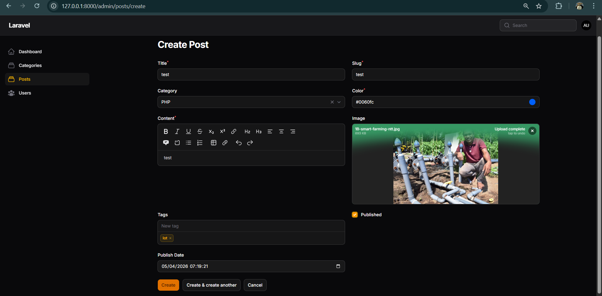
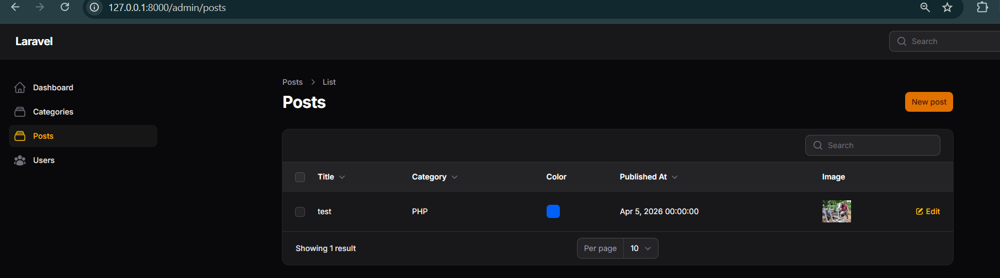
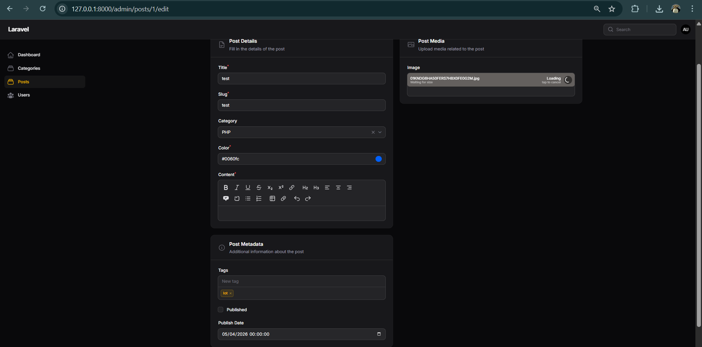
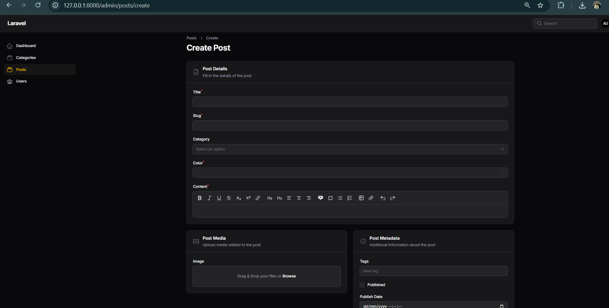
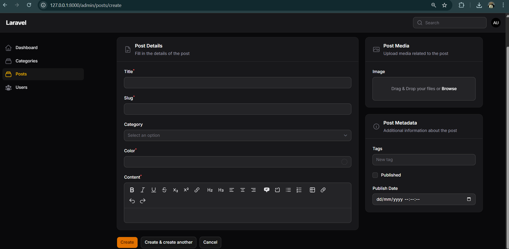
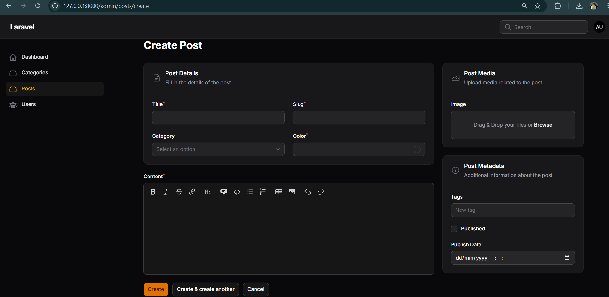
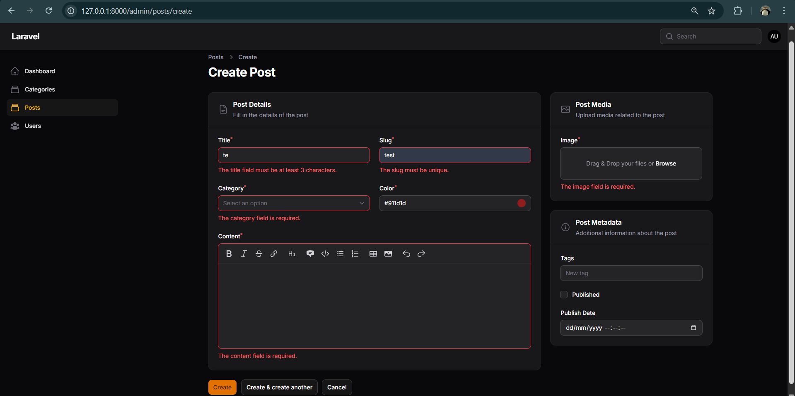

# Week 6 - Form Elements, Validation & Layout di Filament

## 📚 Topik Pembelajaran

Minggu ini fokus mempelajari:

- Implementasi Form Elements & Resource Post
- Custom Layout Form dengan Section & Group
- Form Validation di Filament
- Advanced field configurations dan styling

---

## 📝 JS 4 - Implementasi Form Elements & Resource Post di Filament

### Penjelasan:

Pada tahap ini kita mempelajari berbagai form elements yang tersedia di Filament untuk membuat resource Post yang lebih kaya fitur. Form elements meliputi TextInput, Textarea, RichEditor, MarkdownEditor, Select, dan lainnya. Kita juga mengimplementasikan file upload dan field relationships.

**Fitur yang dipelajari:**

#### 1. Berbagai Form Elements di PostResource

```php
<?php

namespace App\Filament\Resources;

use App\Models\Post;
use Filament\Forms\Components\{
    Section,
    TextInput,
    Textarea,
    RichEditor,
    Select,
    Toggle,
    FileUpload,
    DateTimePicker,
};
use Filament\Forms\Form;
use Filament\Resources\Resource;
use Filament\Tables\Table;
use Filament\Tables\Columns\TextColumn;

class PostResource extends Resource
{
    protected static ?string $model = Post::class;

    public static function form(Form $form): Form
    {
        return $form
            ->schema([
                Section::make('Post Information')
                    ->schema([
                        TextInput::make('title')
                            ->required()
                            ->maxLength(255)
                            ->columnSpanFull(),

                        Select::make('category_id')
                            ->relationship('category', 'name')
                            ->required(),

                        FileUpload::make('featured_image')
                            ->image()
                            ->directory('posts'),
                    ]),

                Section::make('Content')
                    ->schema([
                        RichEditor::make('content')
                            ->required()
                            ->columnSpanFull(),
                    ]),

                Section::make('Publishing')
                    ->schema([
                        Toggle::make('is_published'),
                        DateTimePicker::make('published_at'),
                    ]),
            ]);
    }

    public static function table(Table $table): Table
    {
        return $table
            ->columns([
                TextColumn::make('id'),
                TextColumn::make('title'),
                TextColumn::make('category.name'),
                TextColumn::make('created_at'),
            ])
            ->filters([])
            ->actions([])
            ->bulkActions([]);
    }
}
```

#### 2. Setup Storage Link (untuk upload files)

```bash
php artisan storage:link
```

### Screenshot:




**Hasil:**

- ✅ Resource Post dengan berbagai form elements
- ✅ File upload functionality
- ✅ Relationship select untuk category

### 📌 Analisis & Diskusi

**Q1: Mengapa kita perlu `storage:link`?**

`storage:link` membuat symbolic link dari `storage/app/public` ke `public/storage`. Ini memungkinkan file yang di-upload dapat diakses publik melalui URL.

```bash
# Tanpa storage:link
# File: storage/app/public/posts/image.jpg
# Akses: Tidak bisa dari browser (folder storage private)

# Dengan storage:link
# File: storage/app/public/posts/image.jpg
# Akses: /storage/posts/image.jpg (bisa dari browser)
```

**Q2: Apa fungsi `$casts` untuk field JSON?**

`$casts` mengkonversi data saat disimpan/diambil dari database. Berguna untuk field JSON atau array.

```php
protected $casts = [
    'meta' => 'json', // Otomatis encode ke JSON saat save
    'tags' => 'array', // Otomatis serialize array
    'created_at' => 'datetime',
];

// Penggunaan:
$post->meta = ['color' => 'red', 'size' => 'large']; // Array
$post->save(); // Otomatis di-convert ke JSON string

$post = Post::find(1);
$post->meta['color']; // Otomatis di-convert kembali ke array
```

**Q3: Mengapa kita menggunakan `category.name` bukan `category_id`?**

Karena user interface lebih user-friendly menampilkan nama category daripada ID numerik:

```php
// Dengan Select relationship:
Select::make('category_id')
    ->relationship('category', 'name') // Tampilkan 'name' tapi simpan 'id'
    // Hasil: ["1" => "Tech", "2" => "Lifestyle"]
    // User lihat: "Tech" atau "Lifestyle"
    // Database simpan: 1 atau 2 (category_id)
```

**Q4: Apa perbedaan RichEditor dan MarkdownEditor?**

- **RichEditor**: WYSIWYG editor dengan toolbar (Bold, Italic, Links, dll). Output HTML
- **MarkdownEditor**: Markdown syntax editor. Output Markdown text

```php
// RichEditor - output HTML
RichEditor::make('content')
// Simpan: <p>Hello <strong>World</strong></p>

// MarkdownEditor - output Markdown
MarkdownEditor::make('description')
// Simpan: Hello **World**
```

---

## 📝 JS 5 - Custom Layout Form dengan Section & Group di Filament

### Penjelasan:

Layout form yang baik meningkatkan user experience. Filament menyediakan Section dan Group untuk mengorganisir field secara terstruktur. Section membuat grouping visual dengan header, sedangkan Group hanya grouping logis tanpa visual separator.

**Konsep Layout:**

#### 1. Contoh Form dengan Section dan Group

```php
<?php

namespace App\Filament\Resources;

use App\Models\Post;
use Filament\Forms\Components\{
    Section,
    Group,
    TextInput,
    Textarea,
    RichEditor,
    Select,
    Toggle,
};
use Filament\Forms\Form;
use Filament\Resources\Resource;
use Filament\Tables\Table;

class PostResource extends Resource
{
    protected static ?string $model = Post::class;

    public static function form(Form $form): Form
    {
        return $form
            ->schema([
                // Section dengan 2 kolom
                Section::make('Post Details')
                    ->description('Informasi dasar post')
                    ->schema([
                        TextInput::make('title')
                            ->required()
                            ->columnSpan(2), // Full width (2 dari 2 kolom)

                        Select::make('category_id')
                            ->relationship('category', 'name')
                            ->required()
                            ->columnSpan(1), // Half width

                        Select::make('author_id')
                            ->relationship('author', 'name')
                            ->columnSpan(1),
                    ])
                    ->columns(2),

                // Section dengan Group
                Section::make('Content')
                    ->schema([
                        Group::make()
                            ->schema([
                                TextInput::make('meta_title')
                                    ->label('SEO Title'),
                                TextInput::make('meta_description')
                                    ->label('SEO Description'),
                            ]),

                        RichEditor::make('content')
                            ->required()
                            ->columnSpanFull(),
                    ])
                    ->columns(1),

                // Section untuk publishing settings
                Section::make('Publishing Settings')
                    ->schema([
                        Toggle::make('is_published')
                            ->label('Publish Post'),
                        Toggle::make('is_featured')
                            ->label('Feature on Homepage'),
                    ])
                    ->columns(2),
            ]);
    }

    public static function table(Table $table): Table
    {
        return $table
            ->columns([
                TextColumn::make('title'),
                TextColumn::make('category.name'),
            ])
            ->filters([])
            ->actions([])
            ->bulkActions([]);
    }
}
```

#### 2. Grid System Filament

Filament menggunakan grid 12 kolom:

```php
->columns(12) // Total 12 kolom

->columnSpan(12) // Full width (12/12)
->columnSpan(6)  // Half width (6/12)
->columnSpan(4)  // Third (4/12)
->columnSpan(3)  // Quarter (3/12)
->columnSpan(1)  // Minimum
```

### Screenshot:






**Hasil:**

- ✅ Form yang terorganisir dengan Section
- ✅ Responsive grid layout
- ✅ Improved user experience

### 📌 Analisis & Diskusi

**Q1: Mengapa layout form penting dalam aplikasi admin?**

Layout yang baik mempengaruhi UX dan produktivitas user:

1. **Cognitive Load**: Grouping field yang relevan mengurangi overwhelm
2. **Scanning**: User dapat dengan cepat menemukan field yang dicari
3. **Hierarchy**: Visual hierarchy menunjukkan prioritas field
4. **Error Prevention**: Grouping mencegah user mengisi field yang salah

```php
// ❌ Buruk - semua field campur
TextInput::make('title'),
TextInput::make('meta_title'),
TextInput::make('slug'),
TextInput::make('content'),
TextInput::make('seo_description'),

// ✅ Baik - field terorganisir
Section::make('Basic Info')
    ->schema([
        TextInput::make('title'),
        TextInput::make('slug'),
    ]),
Section::make('SEO')
    ->schema([
        TextInput::make('meta_title'),
        TextInput::make('seo_description'),
    ]),
Section::make('Content')
    ->schema([
        TextInput::make('content'),
    ]),
```

**Q2: Apa perbedaan Section dan Group?**

| Aspek           | Section                       | Group                      |
| --------------- | ----------------------------- | -------------------------- |
| **Visual**      | Render dengan header & border | Hanya logical grouping     |
| **Appearance**  | User lihat pembagian jelas    | Tidak terlihat pembagian   |
| **Use Case**    | Major sections/groups         | Sub-grouping dalam section |
| **Collapsible** | Bisa di-collapse              | Tidak bisa                 |

```php
// Section - terlihat
Section::make('SEO Settings')
    ->schema([...]) // User lihat: "SEO Settings" dengan box

// Group - tidak terlihat
Group::make()
    ->schema([...]) // User tidak tahu ada grouping
```

**Q3: Kapan kita menggunakan `columnSpanFull()`?**

`columnSpanFull()` = `columnSpan(12)` - membuat field mengambil full width:

```php
Section::make('Post Details')
    ->schema([
        TextInput::make('title')
            ->columnSpanFull(), // Full width (12 kolom)

        TextInput::make('slug')
            ->columnSpan(6), // Half width (6 kolom)

        TextInput::make('status')
            ->columnSpan(6), // Half width (6 kolom)
    ])
    ->columns(2), // Default 2 kolom

// Hasil:
// [Title                                    ]
// [Slug          ] [Status                 ]
```

**Q4: Apa keuntungan sistem grid 12 kolom?**

Grid 12 kolom fleksibel dan responsive:

```php
->columns(12)

// Kombinasi yang mungkin:
->columnSpan(12) // 1 kolom
->columnSpan(6)  // 2 kolom
->columnSpan(4)  // 3 kolom
->columnSpan(3)  // 4 kolom
->columnSpan(2)  // 6 kolom
->columnSpan(1)  // 12 kolom

// Contoh layout kompleks:
// [Field A (12/12)                         ]
// [Field B (6/12)        ] [Field C (6/12) ]
// [D (4/12)] [E (4/12)] [F (4/12)]
```

---

## 📝 JS 6 - Implementasi Form Validation pada Filament

### Penjelasan:

Validasi adalah aspek krusial dalam aplikasi untuk memastikan data yang disimpan valid dan aman. Filament menyediakan built-in validation rules yang dapat dikombinasikan dengan Laravel validation rules. Validasi terjadi di client-side (real-time) dan server-side (saat submit).

**Jenis Validasi:**

#### 1. Contoh Form dengan Comprehensive Validation

```php
<?php

namespace App\Filament\Resources;

use App\Models\Post;
use Filament\Forms\Components\{
    Section,
    TextInput,
    Textarea,
    RichEditor,
    Select,
    FileUpload,
};
use Filament\Forms\Form;
use Filament\Resources\Resource;
use Filament\Tables\Table;
use Illuminate\Validation\Rules\Unique;

class PostResource extends Resource
{
    protected static ?string $model = Post::class;

    public static function form(Form $form): Form
    {
        return $form
            ->schema([
                Section::make('Post Information')
                    ->schema([
                        TextInput::make('title')
                            ->required()
                            ->maxLength(255)
                            ->minLength(5)
                            ->regex('/^[a-zA-Z0-9\s\-]+$/')
                            ->helperText('Hanya huruf, angka, dan tanda hubung')
                            ->columnSpanFull(),

                        TextInput::make('slug')
                            ->required()
                            ->unique(
                                table: 'posts',
                                column: 'slug',
                                ignoreRecord: true // Abaikan record saat ini saat edit
                            )
                            ->regex('/^[a-z0-9\-]+$/')
                            ->helperText('Lowercase, angka, dan tanda hubung')
                            ->columnSpanFull(),

                        Select::make('category_id')
                            ->relationship('category', 'name')
                            ->required()
                            ->searchable()
                            ->preload(),

                        FileUpload::make('featured_image')
                            ->image()
                            ->maxSize(5120) // 5MB
                            ->acceptedFileTypes(['image/jpeg', 'image/png', 'image/webp']),
                    ]),

                Section::make('Content')
                    ->schema([
                        RichEditor::make('content')
                            ->required()
                            ->minLength(20)
                            ->maxLength(10000)
                            ->helperText('Minimum 20 karakter, maksimal 10000')
                            ->columnSpanFull(),

                        Textarea::make('excerpt')
                            ->maxLength(500)
                            ->helperText('Optional - preview text'),
                    ]),
            ]);
    }

    public static function table(Table $table): Table
    {
        return $table
            ->columns([
                TextColumn::make('title'),
                TextColumn::make('slug'),
            ])
            ->filters([])
            ->actions([])
            ->bulkActions([]);
    }
}
```

#### 2. Custom Validation Rules

```php
use Illuminate\Validation\Rules\{Unique, Exists};

TextInput::make('email')
    ->email()
    ->required()
    ->unique(
        table: 'users',
        column: 'email',
        ignoreRecord: true,
    )
    ->helperText('Email harus unik'),

Select::make('role_id')
    ->relationship('role', 'name')
    ->exists(
        table: 'roles',
        column: 'id'
    ),
```

### Screenshot:



**Hasil:**

- ✅ Client-side validation (real-time feedback)
- ✅ Server-side validation (saat submit)
- ✅ Custom validation rules
- ✅ User-friendly error messages

### 📌 Analisis & Diskusi

**Q1: Mengapa validasi penting pada admin panel?**

Validasi melayani beberapa tujuan penting:

1. **Data Integrity**: Hanya data valid yang masuk database
2. **User Experience**: Instant feedback tanpa submit
3. **Security**: Mencegah SQL injection, XSS, dan malicious input
4. **Business Logic**: Enforce rules bisnis (unique email, status valid, dll)

```php
// Tanpa validasi: Data buruk masuk database
"title" => "   " // Spasi saja
"email" => "bukan-email" // Format invalid
"slug" => "This Has Spaces" // Seharusnya lowercase

// Dengan validasi: Data dijamin valid
"title" => required, min 5 karakter
"email" => valid email format
"slug" => lowercase + hyphens only
```

**Q2: Apa perbedaan validasi client-side dan server-side?**

| Aspek         | Client-Side       | Server-Side             |
| ------------- | ----------------- | ----------------------- |
| **Lokasi**    | Browser user      | Server                  |
| **Kecepatan** | Instant feedback  | Setelah submit          |
| **Security**  | ❌ Bisa di-bypass | ✅ Tidak bisa di-bypass |
| **Use Case**  | UX improvement    | Security requirement    |
| **Teknologi** | JavaScript        | PHP/Laravel             |

```php
// Client-side (instant feedback)
TextInput::make('email')
    ->email() // Browser cek format saat user typing

// Server-side (saat submit - WAJIB)
// Di dalam form atau Controller validation
'email' => 'required|email|unique:users,email'

// Best practice: Gunakan KEDUANYA
TextInput::make('email')
    ->email()
    ->required()
    ->unique(table: 'users', column: 'email')
```

**Q3: Mengapa `unique` otomatis bekerja saat edit data?**

Parameter `ignoreRecord: true` mengecualikan record saat ini dari pengecekan unique:

```php
// ❌ Tanpa ignoreRecord (saat edit email)
// Email: user@example.com (unchanged)
// Validasi: unique check di database
// Hasil: ERROR - email sudah ada (milik record ini sendiri!)

// ✅ Dengan ignoreRecord: true
// Email: user@example.com (unchanged)
// Validasi: unique check KECUALI record saat ini
// Hasil: ✓ OK - email tidak berubah

unique(
    table: 'users',
    column: 'email',
    ignoreRecord: true, // Abaikan record saat ini
)
```

**Q4: Kapan kita perlu menggunakan `rules` array dibanding string?**

- **String**: Simple rules, readable, tapi infleksibel
- **Array**: Complex rules, conditional, dynamic values

```php
// String rules - simple
'email' => 'required|email|unique:users,email'

// Array rules - lebih flexible
'email' => [
    'required',
    'email',
    Rule::unique('users', 'email')->ignoreRecord($post->id),
]

// Array rules - conditional
'phone' => [
    'required_if:contact_type,phone',
    'regex:/^[0-9\-\+\(\)]+$/',
],

// Array rules - dynamic (berdasarkan variabel)
[
    'password' => [
        'required',
        Password::min(8)
            ->mixedCase()
            ->numbers()
            ->symbols()
            ->uncompromised()
    ]
]
```

---

## 📌 Ringkasan Minggu 6

| Topik    | Output                                              |
| -------- | --------------------------------------------------- |
| **JS 4** | ✅ Form elements & resource Post dengan file upload |
| **JS 5** | ✅ Custom layout dengan Section & Group             |
| **JS 6** | ✅ Form validation comprehensive                    |

## 🎯 Key Takeaways

1. **Form Elements** - Filament provides rich components (RichEditor, FileUpload, Select, etc)
2. **Layout** - Proper organization dengan Section & Group meningkatkan UX
3. **Grid System** - 12-column grid memberikan fleksibilitas layout responsif
4. **Validation** - Kombinasi client-side dan server-side untuk data security
5. **User Experience** - Detail kecil seperti helper text & error messages penting
