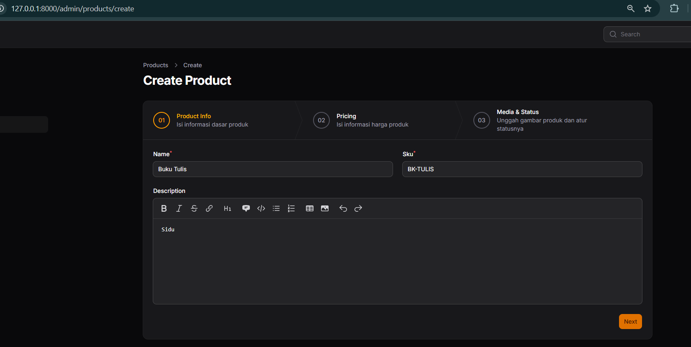
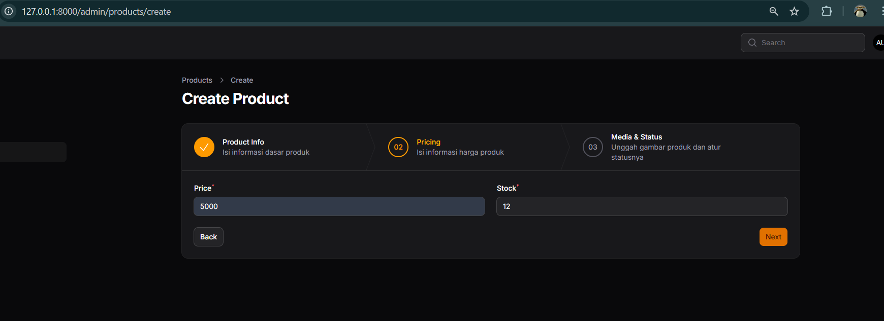
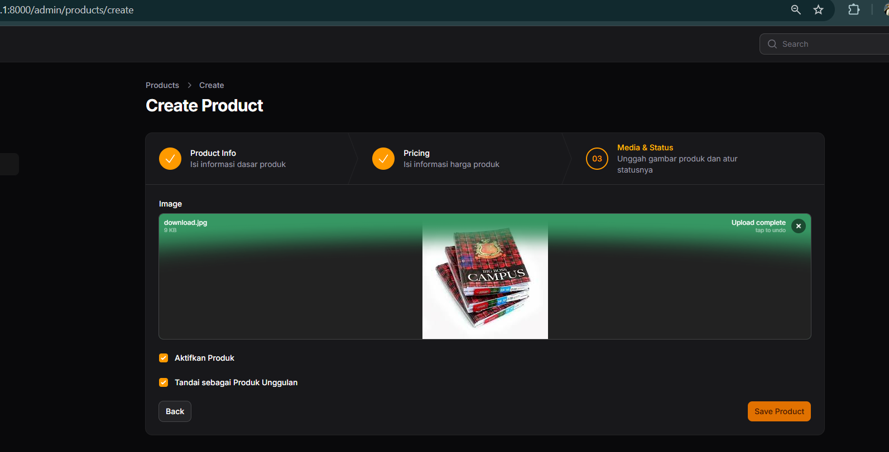
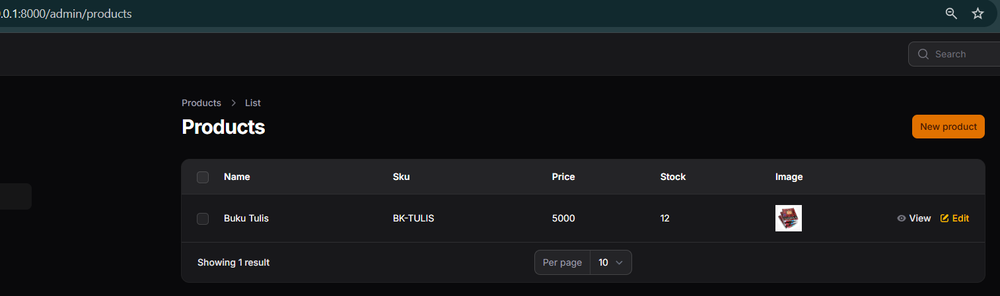
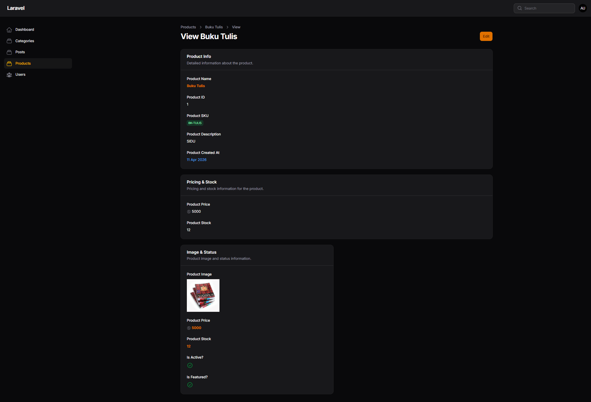
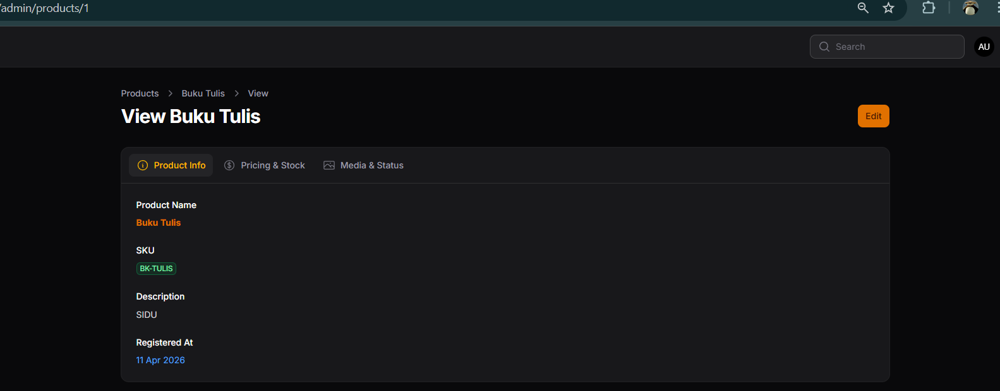
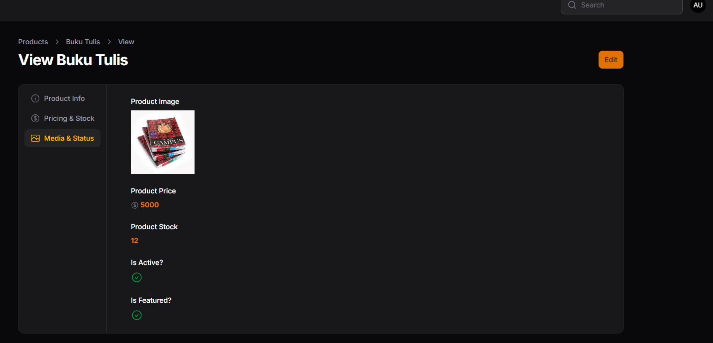

# Week 7 - Wizard Form, Info List & Tabs di Filament

## 📚 Topik Pembelajaran

Minggu ini fokus mempelajari:

- Implementasi Wizard Form (Multi-Step Form)
- Info List / View Page dengan Entry components
- Tabs untuk mengorganisir data panjang
- Best practices untuk UX yang lebih baik

---

## 📝 JS 7 - Implementasi Wizard Form (Multi Step Form) di Filament

### Penjelasan:

Wizard Form adalah form yang dibagi menjadi beberapa step/langkah. Ini sangat berguna untuk form yang panjang atau kompleks agar user tidak overwhelmed. Filament menyediakan dukungan penuh untuk wizard form dengan validasi per step, skippable steps, dan completion actions.

**Konsep Wizard Form:**

#### 1. Membuat Wizard Form Resource (ProductForm.php)

```php
<?php

namespace App\Filament\Resources\Products\Schemas;

use Filament\Schemas\Schema;
use Filament\Schemas\Components\Wizard;
use Filament\Schemas\Components\Wizard\Step;
use Filament\Schemas\Components\Group;
use Filament\Forms\Components\TextInput;
use Filament\Forms\Components\MarkdownEditor;
use Filament\Forms\Components\FileUpload;
use Filament\Forms\Components\Checkbox;
use Filament\Actions\Action;

class ProductForm
{
    public static function configure(Schema $schema): Schema
    {
        return $schema
            ->components([
                Wizard::make([
                    // Step 1: Product Info
                    Step::make('Product Info')
                        ->description('Isi informasi dasar produk')
                        ->schema([
                            Group::make([
                                TextInput::make('name')
                                    ->required(),
                                TextInput::make('sku')
                                    ->required(),
                            ])->columns(2),
                            MarkdownEditor::make('description')
                        ]),

                    // Step 2: Pricing
                    Step::make('Pricing')
                        ->description('Isi informasi harga produk')
                        ->schema([
                            Group::make([
                                TextInput::make('price')
                                    ->required(),
                                TextInput::make('stock')
                                    ->required(),
                            ])->columns(2),
                        ]),

                    // Step 3: Media & Status
                    Step::make('Media & Status')
                        ->description('Unggah gambar produk dan atur statusnya')
                        ->schema([
                            FileUpload::make('image')
                                ->disk('public')
                                ->directory('product_images'),
                            Checkbox::make('is_active')
                                ->label('Aktifkan Produk'),
                            Checkbox::make('is_featured')
                                ->label('Tandai sebagai Produk Unggulan'),
                        ]),
                ])
                ->skippable()
                ->columnSpanFull()
                ->submitAction(
                    Action::make('save')
                        ->label('Save Product')
                        ->button()
                        ->color('primary')
                        ->submit('save')
                )
            ]);
    }
}
```

#### 2. Advanced Wizard dengan Skippable dan Validation

Pada contoh ProductForm di atas, sudah menunjukkan penggunaan `->skippable()` yang memungkinkan user untuk melewati wizard dengan custom submit action. Contoh lainnya:

```php
// Contoh tambahan: PostForm.php
Step::make('Post Details')
    ->description('Fill in the details of the post')
    ->icon('heroicon-o-document-text')
    ->schema([
        TextInput::make('title')
            ->required()
            ->rules('min:3|max:100'),
        TextInput::make('slug')
            ->required()
            ->unique()
            ->validationMessages([
                'unique' => 'The slug must be unique.',
            ]),
        Select::make('category_id')
            ->required()
            ->relationship('category', 'name')
            ->preload()
            ->searchable(),
        ColorPicker::make('color')->required(),
    ])->columns(2),

// Step dengan MarkdownEditor
MarkdownEditor::make('body')->required(),

// Step opsional (skippable)
Step::make('Post Metadata')
    ->description('Additional information about the post')
    ->skippable()
    ->schema([
        TagsInput::make('tags'),
        Checkbox::make('published')->label('Published'),
        DateTimePicker::make('published_at')
            ->format('Y-m-d H:i:s')
            ->label('Publish Date'),
    ]),
```

### Screenshot:






**Hasil:**

- ✅ Multi-step form yang user-friendly
- ✅ Validasi per step
- ✅ Progress visualization
- ✅ Skippable optional steps

### 📌 Analisis & Diskusi

**Q1: Mengapa Wizard Form lebih baik untuk form panjang?**

Wizard form meningkatkan UX untuk form panjang melalui beberapa cara:

1. **Reduced Cognitive Load**: User fokus pada beberapa field per step, bukan semua field sekaligus
2. **Progress Visualization**: User tahu sudah di mana dan sisa berapa step
3. **Error Isolation**: Jika ada error di step 2, user tidak perlu scroll panjang
4. **Completion Rate**: Data menunjukkan wizard meningkatkan form completion rate

```php
// ❌ Form panjang - user overwhelmed
[Field 1: Title                    ]
[Field 2: Category                 ]
[Field 3: Content (panjang)]
[Field 4: Tags]
[Field 5: Featured Image]
[Field 6: SEO Title]
[Field 7: Meta Description]
... (10+ fields lebih)

// ✅ Wizard - terstruktur
Step 1: Basic Info (3 fields)
Step 2: Content (2 fields)
Step 3: Media & Settings (3 fields)
```

**Q2: Kapan kita menggunakan `skippable()`?**

`skippable()` digunakan untuk optional steps yang user bisa skip tanpa mengisinya:

```php
// ❌ Tidak gunakan skippable untuk required data
Step::make('Basic Info')
    ->skippable() // SALAH - data ini penting!
    ->schema([...]),

// ✅ Gunakan untuk optional/advanced
Step::make('SEO Settings')
    ->skippable() // OK - optional optimization
    ->schema([...]),

Step::make('Analytics Tracking')
    ->skippable() // OK - optional integration
    ->schema([...]),
```

Use case `skippable()`:

- SEO settings (opsional untuk SEO optimization)
- Analytics tracking (opsional untuk tracking)
- Advanced settings (opsional advanced configuration)
- Tags/categories (opsional categorization)

**Q3: Apa kelebihan multi step dibanding single form panjang?**

| Aspek              | Single Form Panjang | Multi-Step Wizard   |
| ------------------ | ------------------- | ------------------- |
| **Kognitif**       | Overwhelming        | Fokus per step      |
| **Completion**     | Lebih rendah        | Lebih tinggi        |
| **Mobile**         | Sulit di-scroll     | Lebih mudah         |
| **Validasi**       | Semua sekaligus     | Per step            |
| **Progress**       | Tidak jelas         | Tervisualisasi      |
| **Error Recovery** | Sulit mencari error | Mudah ke step error |

```php
// Single form - user melihat semua field langsung
// Plus: Sederhana, instant submit
// Minus: Cognitive overload, tinggi bounce rate

// Wizard - user melihat field per step
// Plus: Terstruktur, lebih mudah, tinggi completion
// Minus: Lebih klik, lebih navigasi
```

**Q4: Apakah wizard cocok untuk semua jenis form?**

Tidak! Gunakan wizard untuk form kompleks saja:

```php
// ❌ Tidak perlu wizard
// Form login (2-3 field) -> terlalu simple
// Form subscribe (1 field) -> terlalu simple

// ✅ Gunakan wizard
// Form registrasi lengkap (10+ field)
// Form input produk kompleks
// Form aplikasi dengan banyak section
// Form survei panjang

// ✅ Pertimbangan wizard
// Form 6-10 field dengan clear grouping
// Form di mobile dengan field banyak
// Form dengan optional/advanced settings
```

---

## 📝 JS 8 - Implementasi Info List (View Page) di Filament

### Penjelasan:

Info List (atau View Page) digunakan untuk menampilkan data read-only dengan format yang menarik. Berbeda dengan form yang untuk input, info list menggunakan Entry components untuk display. Entry components lebih variatif untuk menampilkan data dalam berbagai format (text, badge, icon, link, dll).

**Konsep Info List:**

#### 1. Membuat View Page dengan Info List (ProductInfolist.php)

````php
<?php

namespace App\Filament\Resources\Products\Schemas;

use Filament\Schemas\Schema;
use Filament\Schemas\Components\Section;
use Filament\Infolists\Components\TextEntry;
use Filament\Infolists\Components\ImageEntry;
use Filament\Infolists\Components\IconEntry;
use Filament\Schemas\Components\Tabs;
use Filament\Schemas\Components\Tabs\Tab;

class ProductInfolist
{
    public static function configure(Schema $schema): Schema
    {
        return $schema
            ->components([
                Tabs::make('Product Details')
                    ->tabs([
                        // TAB 1: INFO DASAR
                        Tabs\Tab::make('Product Info')
                            ->icon('heroicon-o-information-circle')
                            ->schema([
                                TextEntry::make('name')
                                    ->label('Product Name')
                                    ->weight('bold')
                                    ->color('primary'),
                                TextEntry::make('sku')
                                    ->label('SKU')
                                    ->badge()
                                    ->color('success'),
                                TextEntry::make('description')
                                    ->label('Description')
                                    ->markdown(),
                                TextEntry::make('created_at')
                                    ->label('Registered At')
                                    ->dateTime('d M Y')
                                    ->color('info'),
                            ]),

                        // TAB 2: HARGA & STOK
                        Tabs\Tab::make('Pricing & Stock')
                            ->icon('heroicon-o-currency-dollar')
                            ->schema([
                                TextEntry::make('price')
                                    ->label('Price')
                                    ->icon('heroicon-o-currency-dollar'),
                                TextEntry::make('stock')
                                    ->label('Stock Available')
                                    ->badge()
                                    ->color('warning'),
                            ]),
                    ]),
            ]);
    }
}
```#### 2. Register View Page di Resource (ViewProduct.php)

```php
<?php

namespace App\Filament\Resources\Products\Pages;

use App\Filament\Resources\Products\ProductResource;
use Filament\Actions\EditAction;
use Filament\Resources\Pages\ViewRecord;

class ViewProduct extends ViewRecord
{
    protected static string $resource = ProductResource::class;

    protected function getHeaderActions(): array
    {
        return [
            EditAction::make(),
        ];
    }
}
````

Contoh lain dari PostResource dengan Edit Action:

```php
<?php

namespace App\Filament\Resources\Posts\Pages;

use App\Filament\Resources\Posts\PostResource;
use Filament\Actions\DeleteAction;
use Filament\Resources\Pages\EditRecord;

class EditPost extends EditRecord
{
    protected static string $resource = PostResource::class;

    protected function getHeaderActions(): array
    {
        return [
            DeleteAction::make(),
        ];
    }

    protected function getRedirectUrl(): string
    {
        return $this->getResource()::getUrl('index');
    }
}
```

### Screenshot:



**Hasil:**

- ✅ View page yang user-friendly
- ✅ Data ditampilkan dalam format readable
- ✅ Badges dan icons untuk visual status
- ✅ Copy-able dan HTML-rendered content

### 📌 Analisis & Diskusi

**Q1: Mengapa View Page tidak cocok menggunakan form input?**

View page untuk display read-only, bukan input. Form input untuk editing. Alasannya:

1. **Security**: Menampilkan input field mengundang user untuk edit (meski disabled)
2. **UX**: User bingung karena field terlihat editable padahal tidak
3. **Performa**: Form lebih heavy dibanding simple display
4. **Intent**: Form = intent to change, Info List = intent to view
5. **Validation**: Info list tidak perlu validation logic

```php
// ❌ SALAH - gunakan form untuk view
TextInput::make('title')
    ->disabled() // Terlihat editable tapi disabled - confusing!

// ✅ BENAR - gunakan info list
TextEntry::make('title')
// Clear intent: ini untuk view, bukan edit
```

**Q2: Apa perbedaan TextColumn dan TextEntry?**

| Aspek        | TextColumn            | TextEntry              |
| ------------ | --------------------- | ---------------------- |
| **Lokasi**   | Table listing         | Info list / View page  |
| **Purpose**  | Display di table      | Display di detail view |
| **Styling**  | Compact, table format | Full width, readable   |
| **Features** | Sortable, searchable  | Copyable, badge, html  |
| **Use Case** | List page             | View/detail page       |

```php
// TextColumn - di table listing
class PostResource extends Resource
{
    public static function table(Table $table): Table
    {
        return $table
            ->columns([
                TextColumn::make('title')
                    ->searchable()
                    ->sortable(),
            ]);
    }
}

// TextEntry - di info list / view page
class ViewPost extends ViewRecord
{
    public function infolist(Infolist $infolist): Infolist
    {
        return $infolist
            ->schema([
                TextEntry::make('title')
                    ->copyable(),
            ]);
    }
}
```

**Q3: Kapan kita menggunakan badge?**

Badge digunakan untuk menampilkan status/category dalam format compact dan visual:

```php
// ❌ Tanpa badge - kurang clear
TextEntry::make('status')
// Output: "published" atau "draft"

// ✅ Dengan badge - lebih clear
BadgeEntry::make('status')
    ->formatStateUsing(fn ($state) => match ($state) {
        'published' => 'Published',
        'draft' => 'Draft',
        'archived' => 'Archived',
    })
    ->color(fn ($state) => match ($state) {
        'published' => 'success',
        'draft' => 'warning',
        'archived' => 'danger',
    })
// Output: [Published] [Draft] [Archived] dengan warna berbeda

// Atau menggunakan helper
TextEntry::make('category.name')
    ->badge()
    ->color('success')
```

Use case badge:

- Status (published, draft, archived)
- Priority (high, medium, low)
- Type/Category
- Tags
- Boolean dengan label

**Q4: Apa keuntungan menggunakan IconEntry untuk boolean?**

IconEntry lebih visual untuk boolean dibanding text:

```php
// ❌ TextEntry untuk boolean - kurang visual
TextEntry::make('is_featured')
// Output: "1" atau "0" atau "true/false"

// ✅ IconEntry untuk boolean - lebih visual
IconEntry::make('is_featured')
    ->boolean()
// Output: ✓ atau ✗ (icon visual)

// ✅ Atau custom icon
IconEntry::make('is_featured')
    ->icon(fn ($state) => $state ? 'heroicon-o-star' : 'heroicon-o-star-outline')
    ->color(fn ($state) => $state ? 'warning' : 'gray')
// Output: ⭐ atau ☆ (filled atau outline star)
```

Keuntungan IconEntry:

1. **Instant Visual**: User langsung tahu true/false tanpa baca text
2. **Compact**: Icon lebih ringkas daripada text
3. **Universal**: Icon dimengerti di berbagai bahasa
4. **Customizable**: Bisa custom icon per state

---

## 📝 JS 9 - Implementasi Tabs pada Info List di Filament

### Penjelasan:

Tabs mengorganisir info list yang panjang menjadi beberapa tab. Berguna ketika data terlalu banyak untuk ditampilkan dalam satu page. Tabs menyembunyikan data yang tidak sedang dilihat, membuat page lebih clean dan focused.

**Konsep Tabs:**

#### 1. Info List dengan Tabs (ProductInfolist.php)

Contoh lengkap implementasi Tabs pada Info List dari ProductInfolist:

````php
<?php

namespace App\Filament\Resources\Products\Schemas;

use Filament\Schemas\Schema;
use Filament\Schemas\Components\Section;
use Filament\Infolists\Components\TextEntry;
use Filament\Infolists\Components\ImageEntry;
use Filament\Infolists\Components\IconEntry;
use Filament\Schemas\Components\Tabs;
use Filament\Schemas\Components\Tabs\Tab;

class ProductInfolist
{
    public static function configure(Schema $schema): Schema
    {
        return $schema
            ->components([
                Tabs::make('Product Details')
                    ->tabs([
                        // TAB 1: INFO DASAR
                        Tabs\Tab::make('Product Info')
                            ->icon('heroicon-o-information-circle')
                            ->schema([
                                TextEntry::make('name')
                                    ->label('Product Name')
                                    ->weight('bold')
                                    ->color('primary'),
                                TextEntry::make('sku')
                                    ->label('SKU')
                                    ->badge()
                                    ->color('success'),
                                TextEntry::make('description')
                                    ->label('Description')
                                    ->markdown(),
                                TextEntry::make('created_at')
                                    ->label('Registered At')
                                    ->dateTime('d M Y')
                                    ->color('info'),
                            ]),

                        // TAB 2: HARGA & STOK
                        Tabs\Tab::make('Pricing & Stock')
                            ->icon('heroicon-o-currency-dollar')
                            ->schema([
                                TextEntry::make('price')
                                    ->label('Price')
                                    ->icon('heroicon-o-currency-dollar'),
                                TextEntry::make('stock')
                                    ->label('Current Stock')
                                    ->numeric(),
                            ]),

                        // TAB 3: MEDIA & STATUS
                        Tabs\Tab::make('Media & Status')
                            ->icon('heroicon-o-photo')
                            ->schema([
                                ImageEntry::make('image')
                                    ->label('Product Image')
                                    ->disk('public'),
                                IconEntry::make('is_active')
                                    ->label('Is Active?')
                                    ->boolean(),
                                IconEntry::make('is_featured')
                                    ->label('Is Featured?')
                                    ->boolean(),
                            ])
                    ])
                    ->columnSpanFull()
                    ->vertical(),

                // Additional sections di bawah tabs
                Section::make('Product Info')
                    ->description('Detailed information about the product.')
                    ->schema([
                        TextEntry::make('name')
                            ->label('Product Name')
                            ->weight('bold')
                            ->color('primary'),
                        TextEntry::make('id')
                            ->label('Product ID'),
                        TextEntry::make('sku')
                            ->label('Product SKU')
                            ->badge()
                            ->color('success'),
                    ])
                    ->columnSpanFull(),
            ]);
    }
}
```#### 2. Tabs dengan Badge (untuk highlight aktif)

Implementasi tabs dengan count badge atau status indicator:

```php
// Dari ProductInfolist - contoh menggunakan badge dan icons

Tab::make('Product Info')
    ->icon('heroicon-o-information-circle')
    ->schema([
        TextEntry::make('name')
            ->label('Product Name')
            ->weight('bold')
            ->color('primary'),
        TextEntry::make('sku')
            ->label('SKU')
            ->badge()  // Menampilkan sebagai badge
            ->color('success'),
    ]),

Tab::make('Media & Status')
    ->icon('heroicon-o-photo')
    ->badge(fn ($record) => $record->stock < 10 ? 'Low Stock' : null)
    ->badgeColor(fn ($record) => $record->stock < 10 ? 'danger' : 'success')
    ->schema([
        ImageEntry::make('image')
            ->label('Product Image')
            ->disk('public'),
        IconEntry::make('is_active')
            ->label('Is Active?')
            ->boolean(), // Menampilkan checkbox icon
    ]),
````

### Screenshot:




**Hasil:**

- ✅ Info list terorganisir dalam tabs
- ✅ Clean dan focused view
- ✅ Icons untuk quick recognition
- ✅ Badges untuk count/status

### 📌 Analisis & Diskusi

**Q1: Kapan kita menggunakan Tabs dibanding Section?**

| Aspek           | Section                  | Tabs                 |
| --------------- | ------------------------ | -------------------- |
| **Visual**      | Stacked vertikal         | Horizontal tabs      |
| **Visibility**  | Semua visible            | Satu per kali        |
| **Scrolling**   | Perlu scroll panjang     | Tidak perlu scroll   |
| **Data Volume** | Cocok untuk data sedikit | Cocok data banyak    |
| **Focus**       | Semua info sekaligus     | Focus per tab        |
| **Navigation**  | Linear (scroll)          | Quick jump antar tab |

```php
// ❌ SALAH - terlalu banyak section = scroll panjang
Section::make('Basic Info')->schema([...])
Section::make('Content')->schema([...])
Section::make('Media')->schema([...])
Section::make('SEO')->schema([...])
Section::make('Analytics')->schema([...])
Section::make('Comments')->schema([...])
// User perlu scroll sangat jauh!

// ✅ BENAR - gunakan tabs untuk group besar
Tabs::make()
    ->tabs([
        Tab::make('Overview')->schema([
            Section::make('Basic Info')->schema([...])
            Section::make('Status')->schema([...])
        ]),
        Tab::make('Content')->schema([...]),
        Tab::make('Media')->schema([...]),
    ])
```

**Q2: Apa kelebihan Tabs untuk data panjang?**

Tabs memberikan beberapa keuntungan untuk data panjang:

1. **Progressive Disclosure**: Semua data tersedia, tapi disembunyikan sampai dibutuhkan
2. **Focus**: User fokus pada satu topik per tab
3. **Reduced Scrolling**: Tidak perlu scroll panjang
4. **Cleaner UI**: Page terlihat rapi, tidak overwhelming
5. **Mobile Friendly**: Tab lebih cocok untuk mobile

```php
// Tanpa tabs - data panjang (simulasi):
[Basic Info]
[Content (panjang)]
[Media (panjang)]
[Metadata]
[Related Items]
[Comments]
...scroll sampai bawah!

// Dengan tabs:
📄 | 📝 | 🖼️ | ⚙️ | 🔗 | 💬
[Tab 1 content]
```

**Q3: Apakah Tabs bisa digunakan pada Form juga?**

Ya! Tabs bisa digunakan pada form untuk mengorganisir field panjang:

```php
// Tabs pada form (alternatif wizard)
Tabs::make()
    ->tabs([
        Tab::make('Basic')
            ->schema([
                TextInput::make('title'),
                TextInput::make('slug'),
            ]),
        Tab::make('Content')
            ->schema([
                RichEditor::make('content'),
            ]),
        Tab::make('Settings')
            ->schema([
                Toggle::make('is_published'),
            ]),
    ])
    ->columnSpanFull(),

// ⚠️ Perbedaan dengan Wizard:
// - Form Tabs: Semua field disimpan jika ada error, bisa kembali ke tab sebelumnya
// - Wizard: Per-step validation, forward-only (biasanya)
```

**Q4: Bagaimana jika tab terlalu banyak?**

Jika tab lebih dari 5-6, pertimbangkan alternative:

```php
// ❌ Terlalu banyak tab (7+ tab)
Tabs::make()
    ->tabs([
        Tab::make('Tab 1'),
        Tab::make('Tab 2'),
        Tab::make('Tab 3'),
        Tab::make('Tab 4'),
        Tab::make('Tab 5'),
        Tab::make('Tab 6'),
        Tab::make('Tab 7'),
        Tab::make('Tab 8'),
    ])
// Menggulong horizontal = confusing

// ✅ Solusi 1: Group tabs
Tabs::make()
    ->tabs([
        Tab::make('Overview')->schema([
            Section::make('Basic'),
            Section::make('Status'),
        ]),
        Tab::make('Details')->schema([
            Section::make('Metadata'),
            Section::make('Settings'),
        ]),
    ])

// ✅ Solusi 2: Nested tabs
Tabs::make()
    ->tabs([
        Tab::make('Main Info')->schema([
            Tabs::make()
                ->tabs([
                    Tab::make('Personal'),
                    Tab::make('Contact'),
                ])
        ]),
        Tab::make('Advanced'),
    ])

// ✅ Solusi 3: Separate pages
// Buat multiple detail pages atau modal untuk tab yang banyak
```

---

## 📌 Ringkasan Minggu 7

| Topik    | Output                                        |
| -------- | --------------------------------------------- |
| **JS 7** | ✅ Multi-step wizard form untuk form kompleks |
| **JS 8** | ✅ Info list dengan entry components          |
| **JS 9** | ✅ Tabs untuk mengorganisir data panjang      |

## 🎯 Key Takeaways

1. **Wizard Form** - Pisahkan form panjang menjadi beberapa step untuk UX lebih baik
2. **Info List** - Gunakan untuk display read-only dengan entry components yang lebih variatif
3. **Entry Components** - TextEntry, BadgeEntry, IconEntry untuk berbagai format display
4. **Tabs** - Organizer yang powerful untuk data panjang atau multiple sections
5. **Progressive Disclosure** - Tampilkan data sesuai kebutuhan untuk reduce cognitive load
