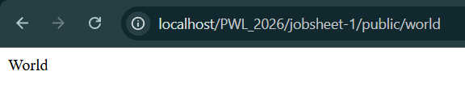
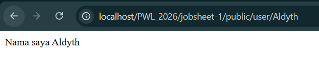
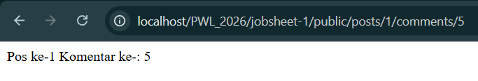
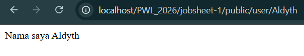
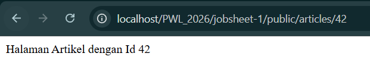

# Laporan Praktikum Pemrograman Web Lanjut (PWL)

## Identitas Mahasiswa
* **Nama:** M. Aldyth Rafiasyah Fauzi
* **NIM:** 244107020179
* **Kelas:** TI-2F

## Pertemuan 2: Routing Laravel 

### Praktikum 1: Dasar Routing

### Praktikum 2: Membuat Controller

